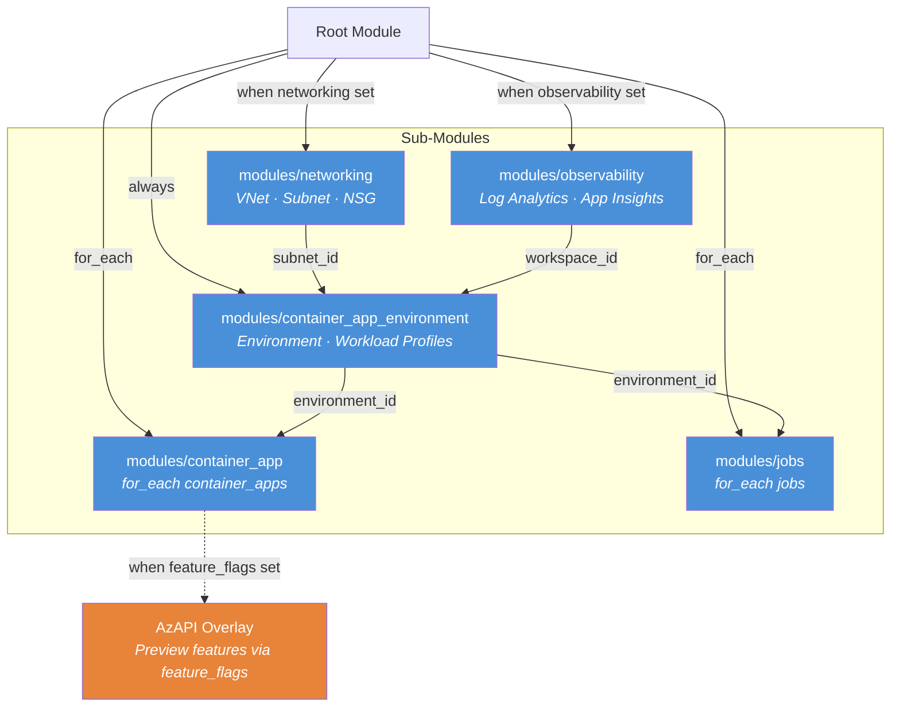

# Terraform Extension Layer for Azure Container Apps

> A facade module that provides an AzureRM-native Terraform experience for Azure
> Container Apps while transparently using AzAPI for features not yet supported
> by AzureRM.

## The Problem

AzureRM's Container Apps support lags the Azure API by **~13 months on average**.
Features like session affinity, CORS policies, advanced scaling rules, and Java
Spring components are available in Azure but require raw AzAPI calls — forcing
teams to learn a second provider, manage JSON payloads, and handle state
migration when AzureRM catches up.

This module solves that by wrapping AzureRM and transparently routing to AzAPI
only when needed, with explicit opt-in via feature flags.

## Key Features

| Feature | Description |
|---------|-------------|
| **AzureRM-first** | All base resources use `azurerm_*` for stability |
| **Transparent AzAPI** | Preview features available without learning AzAPI |
| **Brownfield-friendly** | Variable names match AzureRM resource arguments 1:1 |
| **Feature flags** | Preview features require explicit opt-in |
| **Capability registry** | YAML-based feature→provider mapping |
| **Auto-migration** | Helper script generates state moves when AzureRM catches up |

## Quick Start

```hcl
module "aca" {
  source = "github.com/Azure/terraform-provider-aca"

  name                = "my-app"
  resource_group_name = azurerm_resource_group.rg.name
  location            = azurerm_resource_group.rg.location

  container_apps = {
    api = {
      revision_mode = "Single"
      template = {
        containers = [{
          name   = "api"
          image  = "mcr.microsoft.com/azuredocs/containerapps-helloworld:latest"
          cpu    = 0.25
          memory = "0.5Gi"
        }]
      }
      ingress = {
        external_enabled = true
        target_port      = 80
      }
    }
  }
}
```

### With Networking + Observability

```hcl
module "aca" {
  source = "github.com/Azure/terraform-provider-aca"

  name                = "my-app"
  resource_group_name = azurerm_resource_group.rg.name
  location            = azurerm_resource_group.rg.location

  networking = {
    vnet_address_space        = ["10.0.0.0/16"]
    aca_subnet_address_prefix = "10.0.0.0/23"
  }

  observability = {
    log_analytics_retention_in_days = 60
    create_application_insights     = true
  }

  container_apps = {
    web = {
      revision_mode = "Multiple"
      template = {
        containers = [{
          name   = "web"
          image  = "myacr.azurecr.io/web:v1"
          cpu    = 0.5
          memory = "1Gi"
        }]
        max_replicas = 10
        min_replicas = 1
      }
      ingress = {
        external_enabled = true
        target_port      = 8080
      }
    }
  }
}
```

### With Preview Features (AzAPI overlay)

```hcl
module "aca" {
  source = "github.com/Azure/terraform-provider-aca"

  name                = "my-app"
  resource_group_name = azurerm_resource_group.rg.name
  location            = azurerm_resource_group.rg.location

  container_apps = {
    api = {
      revision_mode = "Single"
      template = {
        containers = [{
          name   = "api"
          image  = "myacr.azurecr.io/api:v1"
          cpu    = 0.25
          memory = "0.5Gi"
        }]
      }
      feature_flags = {
        advanced_ingress = true  # Transparently uses AzAPI
      }
      additional_port_mappings = [{
        external     = false
        target_port  = 9090
        exposed_port = 9090
      }]
    }
  }
}
```

## Examples

All 16 examples have been deployed and validated on Azure.

| Example | Complexity | Key Features |
|---------|------------|--------------|
| [`simple_app`](examples/simple_app/) | ⭐ | VNet, NSG, single app with external ingress |
| [`enterprise_app`](examples/enterprise_app/) | ⭐⭐ | mTLS, workload profiles (D4), App Insights, managed identity |
| [`microservices`](examples/microservices/) | ⭐⭐⭐ | 3-app Dapr service mesh with distributed tracing |
| [`jobs`](examples/jobs/) | ⭐⭐ | CRON scheduled job + event-driven Azure Queue processor |
| [`sessions`](examples/sessions/) | ⭐⭐⭐ | Dynamic session pools (PythonLTS) via AzAPI |
| [`storage`](examples/storage/) | ⭐⭐⭐ | Azure Files SMB mounts (RW + RO) with sub-module composition |
| [`sticky_sessions`](examples/sticky_sessions/) | ⭐⭐ | Session affinity via AzAPI feature flags |
| [`private_endpoint`](examples/private_endpoint/) | ⭐⭐⭐ | VNet + ILB + workload profiles + PE + private DNS |
| [`custom_domains`](examples/custom_domains/) | ⭐⭐ | Conditional custom domain binding with certificates |
| [`autoscaling`](examples/autoscaling/) | ⭐⭐ | HTTP + KEDA scale rules via AzAPI overlay |
| [`additional_ports`](examples/additional_ports/) | ⭐⭐⭐ | gRPC/TCP port mapping via AzAPI advanced ingress |
| [`blue_green`](examples/blue_green/) | ⭐⭐ | Multi-revision traffic splitting |
| [`cors_api`](examples/cors_api/) | ⭐⭐ | Frontend + API with CORS policy via AzAPI overlay |
| [`java_spring`](examples/java_spring/) | ⭐⭐⭐ | Eureka + Config Server via AzAPI Java components |
| [`init_containers`](examples/init_containers/) | ⭐⭐ | Init containers with shared EmptyDir volumes |
| [`premium_ingress`](examples/premium_ingress/) | ⭐⭐ | Premium Ingress with dedicated workload profile via AzAPI |

## Architecture



**Blue** = AzureRM (stable) · **Orange** = AzAPI (preview features)

See [architecture.md](architecture.md) for the full architecture reference.

## Submodules

| Module | Description |
|--------|-------------|
| [`container_app_environment`](modules/container_app_environment/) | Managed Environment with optional VNet, workload profiles, zone redundancy |
| [`container_app`](modules/container_app/) | Container App with ingress, Dapr, secrets, and AzAPI overlay |
| [`jobs`](modules/jobs/) | Container App Jobs (scheduled + event-driven) with AzAPI overlay |
| [`networking`](modules/networking/) | VNet, subnet with delegation handling, and NSG |
| [`observability`](modules/observability/) | Log Analytics workspace and Application Insights |

## Migration Guide

When AzureRM adds native support for a feature previously handled by AzAPI, use
the [Migration Guide](docs/migration-guide.md) to transition. A helper script at
`scripts/migrate-feature.ps1` generates the required state migration commands.

## Capability Registry

See [`internal/capability_registry.yaml`](internal/capability_registry.yaml) for
the feature→provider mapping that tracks which features use AzureRM vs AzAPI.

## Testing

Unit tests use Terraform's native testing framework:

```bash
terraform test -test-directory=tests/unit
```

| Test | Module | Validates |
|------|--------|-----------|
| `env_basic` | container_app_environment | Basic environment configuration |
| `env_networking` | networking | VNet, subnet, NSG creation |
| `app_basic` | container_app | Minimal container app |
| `app_ingress` | container_app | Ingress configuration |
| `app_preview_feature` | container_app | Feature flags and AzAPI overlay |
| `job_scheduled` | jobs | CRON-based scheduled job |
| `job_event_driven` | jobs | Event-driven queue job |
| `observability` | observability | Log Analytics and App Insights |

## Automated API Coverage

A [GitHub Actions workflow](.github/workflows/api-coverage.yml) runs weekly to
check for new ACA API versions (both GA and preview) in the
[Azure REST API specs](https://github.com/Azure/azure-rest-api-specs). When a
new version is detected, it launches a Copilot coding agent to analyze coverage
gaps, add module support, create examples, and open a PR.

## Requirements

| Name | Version |
|------|---------|
| terraform | >= 1.5.0 |
| azurerm | >= 4.0.0 |
| azapi | >= 2.0.0 |

## License

[MIT](LICENSE)

## Contributing

See [CONTRIBUTING.md](CONTRIBUTING.md) for development setup and guidelines.
