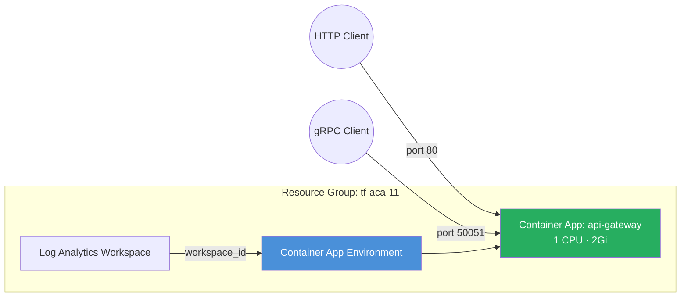

<p class="lead">
Deploy an API gateway that serves both HTTP (port 80) and gRPC (port 50051)
traffic from a single Container App. The module's <code>feature_flags</code>
pattern uses an <code>azapi_update_resource</code> overlay to add port mappings
that the <code>azurerm</code> provider does not yet support.
</p>

## Architecture



## What This Example Demonstrates

- **Multiple port exposure** — HTTP on port 80 and gRPC on port 50051 from one container.
- **Feature-flag pattern** — `feature_flags.advanced_ingress = true` triggers an `azapi_update_resource` overlay that patches the ARM resource with additional port mappings.
- **Provider gap workaround** — Uses AzAPI to surface `additionalPortMappings`, a capability missing from `azurerm` for 340+ days after GA.
- **VNet-integrated environment** — External additional port mappings require a VNet, which is configured automatically.
- **Future-proof migration path** — When `azurerm` adds support, set `provider_overrides = { advanced_ingress = "azurerm" }` to drop the overlay.

## Configuration

```hcl
# Additional Ports Example — Terraform ACA Extension Layer
#
# Demonstrates multiple port mappings via the module's feature_flags pattern.
# The primary ingress serves HTTP on port 80; an additional mapping exposes
# gRPC on port 50051 through an AzAPI overlay.

terraform {
  required_version = ">= 1.5.0"

  required_providers {
    azurerm = {
      source  = "hashicorp/azurerm"
      version = ">= 4.0.0"
    }
    azapi = {
      source  = "Azure/azapi"
      version = ">= 2.0.0"
    }
  }
}

provider "azurerm" {
  features {}
}

provider "azapi" {}

# ---------------------------------------------------------------------------
# Resource Group
# ---------------------------------------------------------------------------

resource "azurerm_resource_group" "this" {
  name     = var.resource_group_name
  location = var.location
  tags     = var.tags
}

# ---------------------------------------------------------------------------
# ACA Module
# ---------------------------------------------------------------------------

module "aca" {
  source = "../../"

  name                = var.name
  resource_group_name = azurerm_resource_group.this.name
  location            = azurerm_resource_group.this.location
  tags                = var.tags

  # VNet required for external additional port mappings
  networking = {
    vnet_address_space        = ["10.11.0.0/16"]
    aca_subnet_address_prefix = "10.11.0.0/23"
  }

  observability = {
    log_analytics_retention_in_days = 30
  }

  container_apps = {
    api-gateway = {
      revision_mode = "Single"
      template = {
        min_replicas = 1
        max_replicas = 5
        containers = [{
          name   = "gateway"
          image  = var.container_image
          cpu    = 1.0
          memory = "2Gi"
          env = [
            { name = "HTTP_PORT", value = "80" },
            { name = "GRPC_PORT", value = "50051" },
          ]
        }]
      }
      ingress = {
        external_enabled = true
        target_port      = 80
        transport        = "auto"
        traffic_weight = [{
          latest_revision = true
          percentage      = 100
        }]
      }
      feature_flags = {
        advanced_ingress = true
      }
      additional_port_mappings = [
        {
          external     = true
          target_port  = 50051
          exposed_port = 50051
        }
      ]
    }
  }
}
```

## Key Variables

| Name | Type | Description | Default |
|------|------|-------------|---------|
| `name` | `string` | Base name for the deployment | `aca-ports` |
| `resource_group_name` | `string` | Name of the resource group to create | `tf-aca-11` |
| `location` | `string` | Azure region | `swedencentral` |
| `container_image` | `string` | Container image for the API gateway app | `mcr.microsoft.com/azuredocs/containerapps-helloworld:latest` |
| `tags` | `map(string)` | Tags for all resources | `{environment="dev", managed_by="terraform"}` |

## Deployment

```bash
# Initialise the working directory
terraform init

# Preview the resources that will be created
terraform plan -out=tfplan

# Apply the plan
terraform apply tfplan

# Get the app URL (HTTP)
terraform output api_gateway_url

# gRPC clients connect to the same FQDN on port 50051

# Tear down all resources when done
terraform destroy
```

<div class="callout callout-warning">
<div class="callout-title">Warning</div>
External additional port mappings require a VNet-integrated environment. The
example configures this automatically via the <code>networking</code> block, but
if you bring your own environment you must ensure it is VNet-injected or the
deployment will fail.
</div>

<div class="callout callout-warning">
<div class="callout-title">Warning</div>
The AzAPI overlay modifies the ARM resource outside of <code>azurerm</code>'s
knowledge. Running <code>terraform plan</code> a second time may show a diff on
the ingress block — this is expected and safe to apply. The overlay is
idempotent.
</div>
