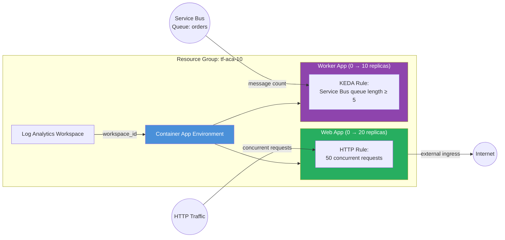

<p class="lead">
  Configure advanced autoscaling on Azure Container Apps using <strong>HTTP
  concurrency rules</strong> and <strong>custom KEDA scalers</strong>. Both apps
  scale to zero when idle, minimising cost for bursty or event-driven workloads.
  Uses sub-modules with <code>azapi_update_resource</code> overlays to inject
  scale rules that the typed template variable does not include.
</p>

## Architecture



## What This Example Demonstrates

- **HTTP concurrency scaling** — the web app scales from 0 to 20 replicas based on concurrent HTTP requests (threshold: 50 per replica).
- **Custom KEDA scaler** — the worker app scales from 0 to 10 replicas based on Azure Service Bus queue message count (threshold: 5 messages).
- **Scale-to-zero** — both apps set `min_replicas = 0`, meaning you pay nothing while idle with no traffic or messages.
- **AzAPI overlay pattern** — `azapi_update_resource` injects scale rules into the ARM template without forking the base module, keeping it clean while giving full control over KEDA configuration.
- **Sub-module composition** — calls `modules/observability`, `modules/container_app_environment`, and `modules/container_app` directly for explicit resource ordering.
- **Headless worker** — the worker app has no ingress and consumes exclusively from the Service Bus queue.

## Configuration

```hcl
# Autoscaling Example — Terraform ACA Extension Layer
#
# Demonstrates advanced autoscaling with HTTP concurrency rules and custom
# KEDA scalers. Uses sub-modules directly so that AzAPI overlay resources
# can add scale rules that the typed template variable does not include.

terraform {
  required_version = ">= 1.5.0"

  required_providers {
    azurerm = {
      source  = "hashicorp/azurerm"
      version = ">= 4.0.0"
    }
    azapi = {
      source  = "Azure/azapi"
      version = ">= 2.0.0"
    }
  }
}

provider "azurerm" {
  features {}
}

provider "azapi" {}

locals {
  tags = {
    Pattern   = "Autoscaling"
    ManagedBy = "Terraform"
  }
}

# ---------------------------------------------------------------------------
# Resource Group
# ---------------------------------------------------------------------------

resource "azurerm_resource_group" "this" {
  name     = var.resource_group_name
  location = var.location
  tags     = local.tags
}

# ---------------------------------------------------------------------------
# Observability
# ---------------------------------------------------------------------------

module "observability" {
  source = "../../modules/observability"

  name_prefix         = var.name
  resource_group_name = azurerm_resource_group.this.name
  location            = azurerm_resource_group.this.location

  create_log_analytics_workspace = true
  tags                           = local.tags
}

# ---------------------------------------------------------------------------
# ACA Environment
# ---------------------------------------------------------------------------

module "environment" {
  source = "../../modules/container_app_environment"

  name                       = var.name
  resource_group_name        = azurerm_resource_group.this.name
  location                   = azurerm_resource_group.this.location
  log_analytics_workspace_id = module.observability.log_analytics_workspace_id
  tags                       = local.tags
}

# ---------------------------------------------------------------------------
# Web App — HTTP concurrency scaling via AzAPI overlay
# ---------------------------------------------------------------------------

module "web_app" {
  source = "../../modules/container_app"

  name                         = "${var.name}-web"
  resource_group_name          = azurerm_resource_group.this.name
  container_app_environment_id = module.environment.id
  revision_mode                = "Single"

  template = {
    min_replicas = 0
    max_replicas = 20
    containers = [{
      name   = "web"
      image  = var.container_image
      cpu    = 0.5
      memory = "1Gi"
    }]
  }

  ingress = {
    external_enabled = true
    target_port      = 80
    transport        = "auto"
    traffic_weight = [{
      latest_revision = true
      percentage      = 100
    }]
  }

  tags = local.tags
}

resource "azapi_update_resource" "web_scaling" {
  type        = "Microsoft.App/containerApps@2025-01-01"
  resource_id = module.web_app.id

  body = {
    properties = {
      template = {
        scale = {
          minReplicas = 0
          maxReplicas = 20
          rules = [{
            name = "http-scaling"
            http = {
              metadata = {
                concurrentRequests = tostring(var.http_concurrency_threshold)
              }
            }
          }]
        }
      }
    }
  }
}

# ---------------------------------------------------------------------------
# Worker App — Azure Service Bus queue scaling via KEDA + AzAPI overlay
# ---------------------------------------------------------------------------

module "worker_app" {
  source = "../../modules/container_app"

  name                         = "${var.name}-worker"
  resource_group_name          = azurerm_resource_group.this.name
  container_app_environment_id = module.environment.id
  revision_mode                = "Single"

  template = {
    min_replicas = 0
    max_replicas = 10
    containers = [{
      name   = "worker"
      image  = var.container_image
      cpu    = 0.5
      memory = "1Gi"
    }]
  }

  tags = local.tags
}

resource "azapi_update_resource" "worker_scaling" {
  type        = "Microsoft.App/containerApps@2025-01-01"
  resource_id = module.worker_app.id

  body = {
    properties = {
      template = {
        scale = {
          minReplicas = 0
          maxReplicas = 10
          rules = [{
            name = "queue-scaling"
            custom = {
              type = "azure-servicebus"
              metadata = {
                queueName    = var.servicebus_queue_name
                messageCount = tostring(var.servicebus_message_count)
                namespace    = var.servicebus_namespace
              }
            }
          }]
        }
      }
    }
  }
}
```

## Key Variables

| Name | Type | Default | Description |
|---|---|---|---|
| `name` | `string` | `"aca-autoscale"` | Base name for the deployment |
| `resource_group_name` | `string` | `"tf-aca-10"` | Name of the resource group to create |
| `location` | `string` | `"swedencentral"` | Azure region |
| `container_image` | `string` | `"mcr.microsoft.com/azuredocs/containerapps-helloworld:latest"` | Container image for both apps |
| `http_concurrency_threshold` | `number` | `50` | Concurrent requests per replica before scaling out the web app |
| `servicebus_namespace` | `string` | `"placeholder-namespace"` | Azure Service Bus namespace for the KEDA scaler |
| `servicebus_queue_name` | `string` | `"orders"` | Azure Service Bus queue name for the KEDA scaler |
| `servicebus_message_count` | `number` | `5` | Queue message count threshold before scaling out the worker app |

## Deployment

```bash
# Initialise Terraform and download providers
terraform init

# Preview the infrastructure changes
terraform plan -out=tfplan

# Apply — creates environment, web app, worker app, and AzAPI scaling overlays
terraform apply tfplan

# Get the web app URL
terraform output web_app_url

# For a real deployment, point the Service Bus scaler at your namespace
terraform apply \
  -var servicebus_namespace=my-sb-namespace \
  -var servicebus_queue_name=orders

# Tear down all resources when finished
terraform destroy
```

<div class="callout callout-warning">
  <div class="callout-title">Warning</div>
  The default <code>servicebus_namespace</code> is <code>"placeholder-namespace"</code>. The worker app will deploy but the KEDA scaler will fail to connect until you provide a real Service Bus namespace with proper authentication (connection string secret or managed identity).
</div>

<div class="callout callout-warning">
  <div class="callout-title">Warning</div>
  Scale-to-zero means cold starts. The first request after an idle period may experience higher latency (typically 5–15 seconds) while ACA provisions a new replica. If this is unacceptable, set <code>min_replicas = 1</code> to keep at least one replica warm.
</div>

<div class="callout callout-warning">
  <div class="callout-title">Warning</div>
  The <code>azapi_update_resource</code> overlays replace the scale configuration on every <code>terraform apply</code>. If you modify scale rules through the Azure Portal or CLI, those changes will be overwritten on the next apply.
</div>
