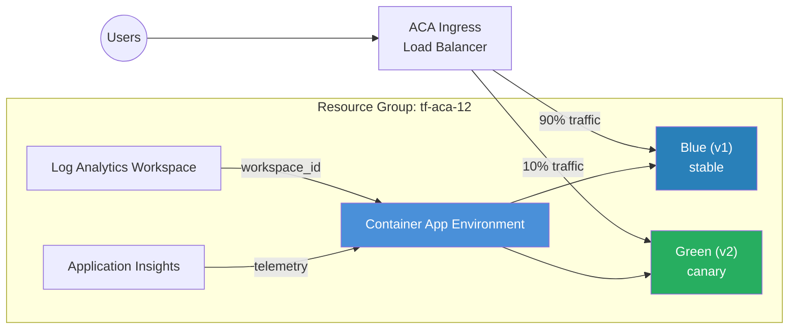

<p class="lead">
Deploy new versions of a Container App alongside existing ones and shift traffic
gradually — with instant rollback. This example uses <strong>Multiple</strong>
revision mode, traffic weights, and revision labels to implement a full
blue/green (or canary) deployment workflow.
</p>

## Architecture



## What This Example Demonstrates

- **Multiple revision mode** — Old revisions stay running while new ones are deployed, enabling side-by-side comparison.
- **Traffic splitting** — Route a percentage of production traffic to the new revision for canary testing.
- **Revision labels** — Each labelled revision gets its own FQDN (`<app>---<label>.<domain>`) for direct access.
- **Application Insights** — Revision-level telemetry to monitor error rates before promoting.
- **Instant rollback** — Shift 100% of traffic back to the previous revision with a single `terraform apply`.

## Configuration

```hcl
# Blue/Green Deployment Example — Terraform ACA Extension Layer
#
# Demonstrates blue/green deployments with multiple revision mode, traffic
# splitting, and revision labels on Azure Container Apps.

terraform {
  required_version = ">= 1.5.0"

  required_providers {
    azurerm = {
      source  = "hashicorp/azurerm"
      version = ">= 4.0.0"
    }
    azapi = {
      source  = "Azure/azapi"
      version = ">= 2.0.0"
    }
  }
}

provider "azurerm" {
  features {}
}

provider "azapi" {}

# ---------------------------------------------------------------------------
# Resource Group
# ---------------------------------------------------------------------------

resource "azurerm_resource_group" "this" {
  name     = var.resource_group_name
  location = var.location
  tags     = var.tags
}

# ---------------------------------------------------------------------------
# ACA Module
# ---------------------------------------------------------------------------

module "aca" {
  source = "../../"

  name                = var.name
  resource_group_name = azurerm_resource_group.this.name
  location            = azurerm_resource_group.this.location
  tags                = var.tags

  observability = {
    log_analytics_retention_in_days = 30
    create_application_insights     = true
  }

  container_apps = {
    web = {
      revision_mode = "Multiple"
      template = {
        min_replicas    = 1
        max_replicas    = 10
        revision_suffix = var.revision_suffix
        containers = [{
          name   = "web"
          image  = var.container_image
          cpu    = 0.5
          memory = "1Gi"
          env = [
            { name = "APP_VERSION", value = var.app_version },
          ]
        }]
      }
      ingress = {
        external_enabled = true
        target_port      = 80
        transport        = "auto"
        traffic_weight = [
          {
            latest_revision = true
            percentage      = 100
            label           = "latest"
          },
        ]
      }
    }
  }
}
```

## Key Variables

| Name | Type | Description | Default |
|------|------|-------------|---------|
| `name` | `string` | Base name for the deployment | `aca-bluegreen` |
| `resource_group_name` | `string` | Name of the resource group to create | `tf-aca-12` |
| `location` | `string` | Azure region | `swedencentral` |
| `container_image` | `string` | Container image for the web app | `mcr.microsoft.com/azuredocs/containerapps-helloworld:latest` |
| `revision_suffix` | `string` | Suffix appended to the revision name — change to create a new revision (e.g. `v1`, `v2`) | `v1` |
| `app_version` | `string` | Application version passed to the container as `APP_VERSION` env var | `1.0.0` |
| `tags` | `map(string)` | Tags for all resources | `{environment="dev", managed_by="terraform"}` |

## Deployment

```bash
# Initialise the working directory
terraform init

# Deploy the initial (blue) revision
terraform plan -out=tfplan
terraform apply tfplan

# Get the app URL
terraform output web_app_url

# Deploy a new (green) revision
terraform apply \
  -var revision_suffix=v2 \
  -var app_version=2.0.0

# Test the green revision directly via its label FQDN:
#   https://<app>---latest.<default-domain>

# Tear down all resources when done
terraform destroy
```

<div class="callout callout-warning">
<div class="callout-title">Warning</div>
When splitting traffic between revisions, ensure the percentages sum to exactly
100. Terraform will reject the plan if they don't, but this is a common mistake
when manually editing <code>traffic_weight</code> blocks.
</div>

<div class="callout callout-warning">
<div class="callout-title">Warning</div>
Changing <code>revision_suffix</code> creates a <em>new</em> revision. If you
reuse a suffix that already exists, the deployment will fail. Always increment
or use a unique value (e.g. a git SHA).
</div>
