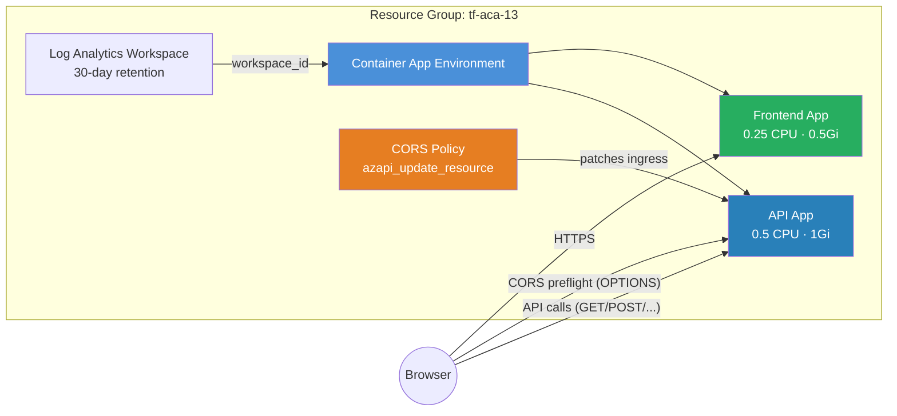

<p class="lead">
Deploy a <strong>frontend SPA</strong> and a <strong>backend API</strong> on
Azure Container Apps, then patch a CORS policy onto the API using
<code>azapi_update_resource</code>. This is the recommended escape-hatch pattern
for any ARM property not yet surfaced by the module or the <code>azurerm</code>
provider.
</p>

## Architecture



## What This Example Demonstrates

- **CORS policy via AzAPI overlay** — The module does not expose a `cors_policy` field; `azapi_update_resource` patches CORS onto the API app's ingress after creation.
- **Two-app architecture** — A frontend SPA and a backend API running as separate Container Apps in the same environment.
- **Configurable allowed origins** — Pass `cors_allowed_origins` to restrict cross-origin access to specific domains.
- **Full CORS header control** — Allowed methods, headers, exposed headers, max-age, and credentials are all configured in the overlay.
- **Provider-gap escape hatch** — Demonstrates the general pattern for surfacing any ARM property that `azurerm` does not yet support.

## Configuration

```hcl
# CORS API Example — Terraform ACA Extension Layer
#
# Demonstrates CORS policy configuration for an API backend serving a
# frontend SPA. Uses azapi_update_resource to patch CORS onto the API
# app after module deployment — the module's container_app template type
# does not include a cors_policy field, and azurerm only added CORS
# support for Container Apps in June 2025 (2+ years after GA in the API).

terraform {
  required_version = ">= 1.5.0"

  required_providers {
    azurerm = {
      source  = "hashicorp/azurerm"
      version = ">= 4.0.0"
    }
    azapi = {
      source  = "Azure/azapi"
      version = ">= 2.0.0"
    }
  }
}

provider "azurerm" {
  features {}
}

provider "azapi" {}

# ---------------------------------------------------------------------------
# Resource Group
# ---------------------------------------------------------------------------

resource "azurerm_resource_group" "this" {
  name     = var.resource_group_name
  location = var.location
  tags     = var.tags
}

# ---------------------------------------------------------------------------
# ACA Module — API + Frontend Apps
# ---------------------------------------------------------------------------

module "aca" {
  source = "../../"

  name                = var.name
  resource_group_name = azurerm_resource_group.this.name
  location            = azurerm_resource_group.this.location
  tags                = var.tags

  observability = {
    log_analytics_retention_in_days = 30
  }

  container_apps = {

    # Backend API: CORS will be patched on after deployment
    api = {
      revision_mode = "Single"
      template = {
        min_replicas = 1
        max_replicas = 10
        containers = [{
          name   = "api"
          image  = var.container_image
          cpu    = 0.5
          memory = "1Gi"
          env = [
            { name = "CORS_ENABLED", value = "true" },
          ]
        }]
      }
      ingress = {
        external_enabled = true
        target_port      = 80
        transport        = "auto"
        traffic_weight = [{ latest_revision = true, percentage = 100 }]
      }
    }

    # Frontend SPA: serves the browser app that calls the API
    frontend = {
      revision_mode = "Single"
      template = {
        min_replicas = 1
        max_replicas = 5
        containers = [{
          name   = "frontend"
          image  = var.container_image
          cpu    = 0.25
          memory = "0.5Gi"
        }]
      }
      ingress = {
        external_enabled = true
        target_port      = 80
        transport        = "auto"
        traffic_weight = [{ latest_revision = true, percentage = 100 }]
      }
    }
  }
}

# ---------------------------------------------------------------------------
# CORS Policy — applied via AzAPI after module creates the API app
# ---------------------------------------------------------------------------
# The module does not expose a cors_policy field on the container_app
# template. We use azapi_update_resource to patch the CORS configuration
# onto the API app's ingress after it has been created.

resource "azapi_update_resource" "api_cors" {
  type        = "Microsoft.App/containerApps@2025-01-01"
  resource_id = module.aca.container_apps["api"].id

  body = {
    properties = {
      configuration = {
        ingress = {
          corsPolicy = {
            allowedOrigins   = var.cors_allowed_origins
            allowedMethods   = ["GET", "POST", "PUT", "DELETE", "OPTIONS"]
            allowedHeaders   = ["*"]
            exposeHeaders    = ["X-Request-Id"]
            maxAge           = 3600
            allowCredentials = true
          }
        }
      }
    }
  }
}
```

## Key Variables

| Name | Type | Description | Default |
|------|------|-------------|---------|
| `name` | `string` | Base name for the deployment | `aca-cors` |
| `resource_group_name` | `string` | Name of the resource group to create | `tf-aca-13` |
| `location` | `string` | Azure region | `swedencentral` |
| `container_image` | `string` | Container image for both the API and frontend apps | `mcr.microsoft.com/azuredocs/containerapps-helloworld:latest` |
| `cors_allowed_origins` | `list(string)` | List of origins allowed to make cross-origin requests to the API | `["https://example.com"]` |
| `tags` | `map(string)` | Tags for all resources | `{environment="dev", managed_by="terraform"}` |

## Deployment

```bash
# Initialise the working directory
terraform init

# Preview the resources that will be created
terraform plan -out=tfplan

# Apply the plan
terraform apply tfplan

# Get the app URLs
terraform output api_url
terraform output frontend_url

# Customise the allowed origins for your domain
terraform apply -var 'cors_allowed_origins=["https://myapp.example.com", "http://localhost:3000"]'

# Tear down all resources when done
terraform destroy
```

<div class="callout callout-warning">
<div class="callout-title">Warning</div>
The CORS policy is applied <em>after</em> the API app is created. If you remove
the <code>azapi_update_resource</code> block and re-apply, the CORS policy will
<strong>not</strong> be removed from the API — you must explicitly set an empty
CORS policy or recreate the app.
</div>

<div class="callout callout-warning">
<div class="callout-title">Warning</div>
Setting <code>allowCredentials = true</code> with <code>allowedOrigins = ["*"]</code>
is rejected by the Azure API. When credentials are enabled you must specify
explicit origin URLs.
</div>
