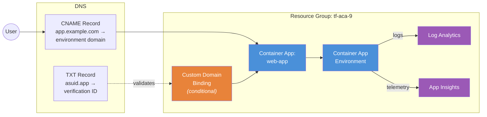

<p class="lead">
  Bind a <strong>custom domain with a managed TLS certificate</strong> to an
  Azure Container App. The app deploys and works with the default ACA domain out
  of the box — custom domain binding is an <strong>optional add-on</strong>
  enabled only when <code>var.custom_domain</code> is set to a real domain name.
</p>

## Architecture



## What This Example Demonstrates

- **DNS-validated custom domain binding** — a two-step flow: create DNS records proving domain ownership, then Terraform creates the `azurerm_container_app_custom_domain` resource which triggers Azure to validate DNS and provision a managed TLS certificate.
- **Conditional resource pattern** — uses `count` so the custom domain resources are created only when `var.custom_domain != ""`, allowing the example to deploy cleanly without any domain configuration.
- **Managed certificate provisioning** — Azure automatically provisions and renews a free TLS certificate for the bound domain.
- **Application Insights integration** — deploys with both Log Analytics and Application Insights for full observability.
- **Lifecycle management** — `ignore_changes` on certificate binding fields prevents Terraform drift after Azure provisions the managed certificate.

## Configuration

```hcl
# Custom Domains Example — Terraform ACA Extension Layer
#
# Demonstrates custom domain binding with managed certificate for Azure
# Container Apps. The domain binding is conditional — when var.custom_domain
# is empty (default), the app deploys without a custom domain. Set the
# variable to a real domain to enable DNS validation and certificate provisioning.

terraform {
  required_version = ">= 1.5.0"

  required_providers {
    azurerm = {
      source  = "hashicorp/azurerm"
      version = ">= 4.0.0"
    }
    azapi = {
      source  = "Azure/azapi"
      version = ">= 2.0.0"
    }
  }
}

provider "azurerm" {
  features {}
}

provider "azapi" {}

# ---------------------------------------------------------------------------
# Resource Group
# ---------------------------------------------------------------------------

resource "azurerm_resource_group" "this" {
  name     = var.resource_group_name
  location = var.location
  tags     = var.tags
}

# ---------------------------------------------------------------------------
# ACA Module — Environment + App
# ---------------------------------------------------------------------------

module "aca" {
  source = "../../"

  name                = var.name
  resource_group_name = azurerm_resource_group.this.name
  location            = azurerm_resource_group.this.location
  tags                = var.tags

  observability = {
    create_log_analytics_workspace = true
    create_application_insights    = true
  }

  container_apps = {
    web = {
      revision_mode = "Single"

      template = {
        min_replicas = 1
        max_replicas = 5

        containers = [{
          name   = "web-app"
          image  = var.container_image
          cpu    = 0.5
          memory = "1Gi"

          env = [
            { name = "CUSTOM_DOMAIN", value = var.custom_domain != "" ? var.custom_domain : "none" },
          ]
        }]
      }

      ingress = {
        external_enabled = true
        target_port      = 80
        transport        = "auto"
        traffic_weight = [{ latest_revision = true, percentage = 100 }]
      }
    }
  }
}

# ---------------------------------------------------------------------------
# Custom Domain Binding (conditional — only when var.custom_domain is set)
# ---------------------------------------------------------------------------
# The custom domain flow is a multi-step process:
#   1. Create a CNAME/TXT DNS record pointing to the ACA environment
#   2. Terraform creates the custom domain resource (triggers DNS validation)
#   3. Azure provisions a managed certificate automatically
#
# Prerequisites before applying with a custom domain:
#   - You own the domain and can create DNS records
#   - A CNAME record: <subdomain> → <environment_default_domain>
#   - A TXT record: asuid.<subdomain> → <custom_domain_verification_id>

resource "azurerm_container_app_custom_domain" "this" {
  count = var.custom_domain != "" ? 1 : 0

  name             = var.custom_domain
  container_app_id = module.aca.container_apps["web"].id

  # For managed certificates, the certificate binding type is set after the
  # certificate is provisioned. Use lifecycle ignore to prevent drift.
  lifecycle {
    ignore_changes = [certificate_binding_type, container_app_environment_certificate_id]
  }
}
```

## Key Variables

| Name | Type | Default | Description |
|---|---|---|---|
| `name` | `string` | `"aca-domains"` | Base name for the deployment |
| `resource_group_name` | `string` | `"tf-aca-9"` | Name of the resource group to create |
| `location` | `string` | `"swedencentral"` | Azure region |
| `tags` | `map(string)` | `{ environment = "dev", ... }` | Tags for all resources |
| `container_image` | `string` | `"mcr.microsoft.com/azuredocs/containerapps-helloworld:latest"` | Container image for the web app |
| `custom_domain` | `string` | `""` | Custom domain to bind (e.g. `app.example.com`). Leave empty to skip binding. |

## Deployment

### Deploy without custom domain (default)

```bash
# Initialise Terraform and download providers
terraform init

# Apply — deploys the app with the default ACA domain
terraform apply

# Get the default URL and verification ID for later use
terraform output web_app_url
terraform output custom_domain_verification_id
terraform output environment_default_domain
```

### Deploy with custom domain

```bash
# Step 1: Deploy the app and note the outputs
terraform apply

# Step 2: Create DNS records at your registrar:
#   CNAME: <subdomain>        → <environment_default_domain>
#   TXT:   asuid.<subdomain>  → <custom_domain_verification_id>

# Step 3: Wait for DNS propagation (may take 5–30 minutes), then bind
terraform apply -var custom_domain="app.example.com"

# Tear down all resources when finished
terraform destroy
```

<div class="callout callout-warning">
  <div class="callout-title">Warning</div>
  DNS records <strong>must be created and propagated before</strong> running <code>terraform apply</code> with <code>var.custom_domain</code> set. If DNS validation fails, the apply will error. Allow 5–30 minutes for propagation.
</div>

<div class="callout callout-warning">
  <div class="callout-title">Warning</div>
  The <code>lifecycle { ignore_changes }</code> block on the custom domain resource is required. After Azure provisions the managed certificate, it updates the <code>certificate_binding_type</code> and <code>container_app_environment_certificate_id</code> fields — without <code>ignore_changes</code>, every subsequent <code>terraform plan</code> would show drift.
</div>

<div class="callout callout-warning">
  <div class="callout-title">Warning</div>
  Custom domains require two DNS records: a <strong>CNAME</strong> pointing your subdomain to the environment's default domain, and a <strong>TXT</strong> record at <code>asuid.&lt;subdomain&gt;</code> containing the verification ID. Missing either record will cause validation to fail.
</div>
