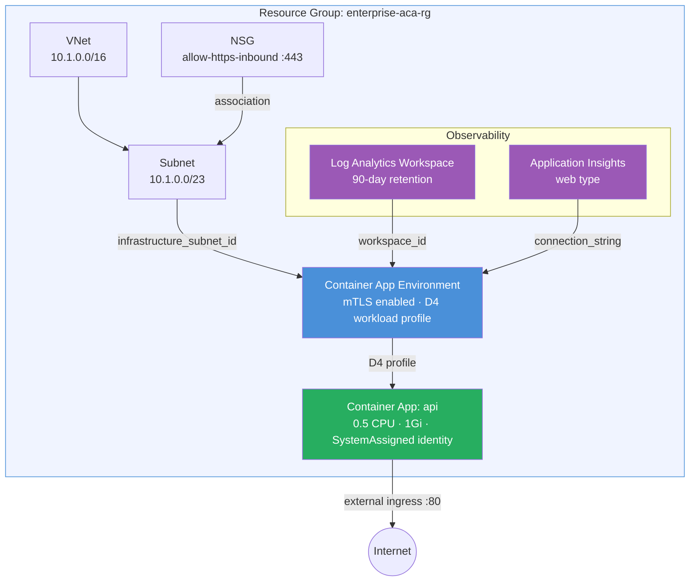

<p class="lead">
Production-grade ACA deployment showcasing VNet integration, dedicated workload
profiles (D4), mutual TLS, managed identity, custom NSG rules, and full
observability with Log Analytics and Application Insights. This is the reference
pattern for running production APIs on Azure Container Apps.
</p>

## Architecture



## What This Example Demonstrates

- **Dedicated workload profiles** — a `D4` compute profile (1–3 nodes) gives the API app dedicated CPU and memory, isolated from Consumption-plan neighbors.
- **Mutual TLS (mTLS)** — environment-level `mutual_tls_enabled = true` encrypts all service-to-service traffic without app-level code changes.
- **Application Insights** — a single `create_application_insights = true` flag creates the resource and wires its connection string into the environment automatically.
- **Managed identity** — `SystemAssigned` identity on the container app enables RBAC-based access to Azure resources (Key Vault, Storage, SQL) without storing credentials.
- **Custom NSG rules** — an HTTPS inbound rule (port 443) is defined inline; the module handles NSG creation and subnet association ordering.
- **90-day log retention** — extended retention for compliance and audit requirements.
- **Cost management tags** — `Environment` and `CostCenter` tags propagate to all resources for chargeback reporting.

## Configuration

```hcl
# Enterprise App Example — Terraform ACA Extension Layer
#
# Demonstrates a production-like deployment with:
# - VNet integration (dedicated subnet)
# - Observability (Log Analytics + Application Insights)
# - Managed identity (system-assigned)
# - Workload profiles (dedicated compute)
# - Tags for cost management

terraform {
  required_version = ">= 1.5.0"

  required_providers {
    azurerm = {
      source  = "hashicorp/azurerm"
      version = ">= 4.0.0"
    }
    azapi = {
      source  = "Azure/azapi"
      version = ">= 2.0.0"
    }
  }
}

provider "azurerm" {
  features {}
}

provider "azapi" {}

# ---------------------------------------------------------------------------
# Resource Group
# ---------------------------------------------------------------------------

resource "azurerm_resource_group" "this" {
  name     = var.resource_group_name
  location = var.location
}

# ---------------------------------------------------------------------------
# ACA Module — Enterprise Configuration
# ---------------------------------------------------------------------------

module "aca" {
  source = "../../"

  name                = var.name
  resource_group_name = azurerm_resource_group.this.name
  location            = azurerm_resource_group.this.location

  tags = {
    Environment = var.environment
    CostCenter  = var.cost_center
    ManagedBy   = "Terraform"
  }

  # --- Networking: VNet-integrated environment ---
  networking = {
    create_vnet               = true
    vnet_address_space        = var.vnet_address_space
    aca_subnet_address_prefix = var.aca_subnet_address_prefix
    create_nsg                = true
    nsg_rules = [
      {
        name                       = "allow-https-inbound"
        priority                   = 200
        direction                  = "Inbound"
        access                     = "Allow"
        protocol                   = "Tcp"
        source_port_range          = "*"
        destination_port_range     = "443"
        source_address_prefix      = "*"
        destination_address_prefix = "*"
      }
    ]
  }

  # --- Observability: Full stack monitoring ---
  observability = {
    create_log_analytics_workspace  = true
    log_analytics_retention_in_days = 90
    create_application_insights     = true
    application_insights_type       = "web"
  }

  # --- Environment: Workload profiles for dedicated compute ---
  environment = {
    zone_redundancy_enabled = false
    mutual_tls_enabled      = true
    workload_profile = [
      {
        name                  = "dedicated-d4"
        workload_profile_type = "D4"
        minimum_count         = 1
        maximum_count         = 3
      }
    ]
  }

  # --- Container App: Production API ---
  container_apps = {
    api = {
      revision_mode = "Single"

      template = {
        min_replicas = var.min_replicas
        max_replicas = var.max_replicas

        containers = [
          {
            name   = "api"
            image  = var.container_image
            cpu    = 0.5
            memory = "1Gi"

            env = [
              { name = "ASPNETCORE_ENVIRONMENT", value = var.environment },
            ]
          }
        ]
      }

      ingress = {
        external_enabled = true
        target_port      = var.container_port
        transport        = "auto"
        traffic_weight = [
          { latest_revision = true, percentage = 100 }
        ]
      }

      identity = {
        type = "SystemAssigned"
      }

      workload_profile_name = "dedicated-d4"

      tags = {
        Service = "api"
        Team    = "backend"
      }
    }
  }
}
```

## Key Variables

| Name | Type | Default | Description |
|------|------|---------|-------------|
| `name` | `string` | `"enterprise-aca"` | Base name for the ACA deployment. |
| `resource_group_name` | `string` | `"enterprise-aca-rg"` | Name of the resource group to create. |
| `location` | `string` | `"eastus2"` | Azure region. |
| `environment` | `string` | `"Production"` | Deployment environment (e.g., Production, Staging). |
| `cost_center` | `string` | `"engineering"` | Cost center tag for billing. |
| `container_image` | `string` | `"mcr.microsoft.com/azuredocs/containerapps-helloworld:latest"` | Container image for the API app. |
| `vnet_address_space` | `list(string)` | `["10.1.0.0/16"]` | Address space for the VNet. |
| `aca_subnet_address_prefix` | `string` | `"10.1.0.0/23"` | Subnet CIDR for the ACA environment (must be /23 or larger). |
| `container_port` | `number` | `80` | Port the container listens on. |
| `min_replicas` | `number` | `1` | Minimum number of container replicas. |
| `max_replicas` | `number` | `5` | Maximum number of container replicas. |

## Deployment

```bash
# Initialize Terraform providers
terraform init

# Preview the deployment
terraform plan -out=tfplan

# Apply the configuration
terraform apply tfplan

# Get the API app name and identity principal ID
terraform output api_name
terraform output managed_identity_principal_id

# Tear down all resources
terraform destroy
```

<div class="callout callout-warning">
<div class="callout-title">Warning</div>
D4 workload profiles require quota in your subscription. Run
<code>az containerapp env workload-profile list-supported -l eastus2</code>
to check availability before deploying. If your subscription lacks quota, the
environment creation will fail with a capacity error.
</div>

<div class="callout callout-warning">
<div class="callout-title">Warning</div>
Enabling <code>mutual_tls_enabled</code> encrypts <em>all</em> intra-environment
traffic. Existing apps that don't handle TLS termination correctly may break.
Test mTLS in a staging environment before enabling it on a production workload.
</div>

<div class="callout callout-warning">
<div class="callout-title">Warning</div>
The <code>SystemAssigned</code> managed identity principal ID is only available
<em>after</em> apply. Use <code>terraform output managed_identity_principal_id</code>
to retrieve it, then assign RBAC roles (e.g., Key Vault Secrets User, Storage Blob
Reader) in a follow-up step or a separate Terraform configuration.
</div>
