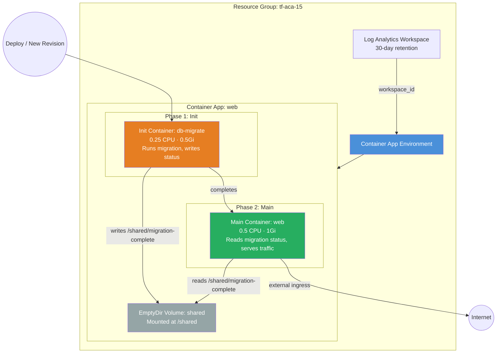

<p class="lead">
Deploy a web application with an <strong>init container</strong> that runs
database migrations before the main container starts. The init container and
main container share an <code>EmptyDir</code> volume so the migration process
can signal completion status to the application.
</p>

## Architecture



## What This Example Demonstrates

- **Init containers** — Run-to-completion containers that execute before any main containers start (the Kubernetes-native sidecar pattern on ACA).
- **Database migration pattern** — Run schema changes, seed data, or verify dependencies before the app boots.
- **Shared EmptyDir volume** — An ephemeral volume mounted into both the init container and the main container for signalling and data exchange.
- **Resource isolation** — The init container has its own CPU/memory allocation (0.25 CPU / 0.5 Gi) separate from the main container (0.5 CPU / 1 Gi).
- **Single module call** — Everything — init containers, volumes, ingress — is defined in a single `container_apps` block.

## Configuration

```hcl
# Init Containers Example — Terraform ACA Extension Layer
#
# Demonstrates init containers for database migration / pre-flight setup.
# The init container runs to completion before the main container starts,
# using a shared EmptyDir volume to signal migration status.

terraform {
  required_version = ">= 1.5.0"

  required_providers {
    azurerm = {
      source  = "hashicorp/azurerm"
      version = ">= 4.0.0"
    }
    azapi = {
      source  = "Azure/azapi"
      version = ">= 2.0.0"
    }
  }
}

provider "azurerm" {
  features {}
}

provider "azapi" {}

# ---------------------------------------------------------------------------
# Resource Group
# ---------------------------------------------------------------------------

resource "azurerm_resource_group" "this" {
  name     = var.resource_group_name
  location = var.location
  tags     = var.tags
}

# ---------------------------------------------------------------------------
# ACA Module — Web App with Init Container
# ---------------------------------------------------------------------------

module "aca" {
  source = "../../"

  name                = var.name
  resource_group_name = azurerm_resource_group.this.name
  location            = azurerm_resource_group.this.location
  tags                = var.tags

  observability = {
    log_analytics_retention_in_days = 30
  }

  container_apps = {

    # Web app with an init container for DB migration
    web = {
      revision_mode = "Single"
      template = {
        min_replicas = 1
        max_replicas = 5

        containers = [{
          name   = "web"
          image  = var.container_image
          cpu    = 0.5
          memory = "1Gi"
          env = [
            { name = "MIGRATION_STATUS_PATH", value = "/shared/migration-complete" },
          ]
          volume_mounts = [
            { name = "shared", path = "/shared" }
          ]
        }]

        init_containers = [{
          name   = "db-migrate"
          image  = "mcr.microsoft.com/azuredocs/containerapps-helloworld:latest"
          cpu    = 0.25
          memory = "0.5Gi"
          env = [
            { name = "MIGRATION_MODE", value = "apply" },
            { name = "DB_HOST", value = "placeholder-db.database.azure.com" },
          ]
          volume_mounts = [
            { name = "shared", path = "/shared" }
          ]
        }]

        volumes = [{
          name         = "shared"
          storage_type = "EmptyDir"
        }]
      }

      ingress = {
        external_enabled = true
        target_port      = 80
        transport        = "auto"
        traffic_weight = [{ latest_revision = true, percentage = 100 }]
      }
    }
  }
}
```

## Key Variables

| Name | Type | Description | Default |
|------|------|-------------|---------|
| `name` | `string` | Base name for the deployment | `aca-init` |
| `resource_group_name` | `string` | Name of the resource group to create | `tf-aca-15` |
| `location` | `string` | Azure region | `swedencentral` |
| `container_image` | `string` | Container image for the main web application | `mcr.microsoft.com/azuredocs/containerapps-helloworld:latest` |
| `tags` | `map(string)` | Tags for all resources | `{environment="dev", managed_by="terraform"}` |

## Deployment

```bash
# Initialise the working directory
terraform init

# Preview the resources that will be created
terraform plan -out=tfplan

# Apply the plan
terraform apply tfplan

# Get the web app URL
terraform output web_url

# Override the container image
terraform apply -var container_image="myregistry.azurecr.io/myapp:v1.0"

# Tear down all resources when done
terraform destroy
```

<div class="callout callout-warning">
<div class="callout-title">Warning</div>
If the init container fails (non-zero exit code), the main container will
<strong>never start</strong> and the revision will remain in a failed state.
Always test your migration image locally before deploying to ACA, and consider
adding a timeout or retry mechanism.
</div>

<div class="callout callout-warning">
<div class="callout-title">Warning</div>
The <code>EmptyDir</code> volume is <strong>ephemeral</strong> — it is wiped on
every new revision deployment. Do not use it for persistent data. For durable
storage, see the Storage example with Azure Files volumes.
</div>

<div class="callout callout-warning">
<div class="callout-title">Warning</div>
The combined CPU and memory of <em>all</em> init containers plus <em>all</em>
main containers must fit within ACA's per-replica limits. If you increase the
init container resources, verify the total does not exceed the maximum allowed
for your workload profile.
</div>
