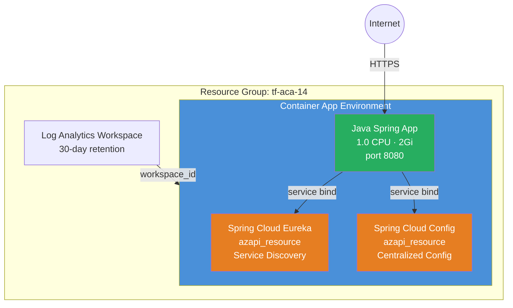

<p class="lead">
Deploy a <strong>Spring Boot application</strong> on Azure Container Apps with
managed <strong>Spring Cloud Eureka</strong> (service discovery) and
<strong>Spring Cloud Config Server</strong> (centralised configuration). These
Java components are environment-level resources with no <code>azurerm</code>
equivalent — they are created via <code>azapi_resource</code> and bound to the
app through service binds.
</p>

## Architecture



## What This Example Demonstrates

- **Managed Java components** — Spring Cloud Eureka and Config Server as environment-level resources, created via `azapi_resource` because `azurerm` does not support them.
- **Sub-module composition** — The environment and app use the module's sub-modules (`container_app_environment`, `container_app`, `observability`), while Java components are managed alongside with AzAPI.
- **Service binds** — Connection information (URLs, credentials) is injected into the app at runtime so Spring Boot auto-discovers Eureka and Config Server with zero manual configuration.
- **Optional Config Server** — Set `enable_config_server = false` to deploy with Eureka only.
- **Custom config repository** — Point Config Server at your own Git repo via `config_git_uri`.

## Configuration

```hcl
# Java Spring Cloud Components Example — Terraform ACA Extension Layer
#
# Demonstrates Java Spring Cloud components (Eureka, Config Server) on ACA.
# These are environment-level resources not available in azurerm — we use
# sub-module composition with azapi_resource to create the Java components
# and bind them to a container app via service binds.

terraform {
  required_version = ">= 1.5.0"

  required_providers {
    azurerm = {
      source  = "hashicorp/azurerm"
      version = ">= 4.0.0"
    }
    azapi = {
      source  = "Azure/azapi"
      version = ">= 2.0.0"
    }
  }
}

provider "azurerm" {
  features {}
}

provider "azapi" {}

# ---------------------------------------------------------------------------
# Resource Group
# ---------------------------------------------------------------------------

resource "azurerm_resource_group" "this" {
  name     = var.resource_group_name
  location = var.location
  tags     = var.tags
}

# ---------------------------------------------------------------------------
# Observability — Log Analytics Workspace
# ---------------------------------------------------------------------------

module "observability" {
  source = "../../modules/observability"

  name_prefix         = var.name
  resource_group_name = azurerm_resource_group.this.name
  location            = azurerm_resource_group.this.location
  tags                = var.tags

  create_log_analytics_workspace  = true
  log_analytics_retention_in_days = 30
}

# ---------------------------------------------------------------------------
# Container App Environment
# ---------------------------------------------------------------------------

module "environment" {
  source = "../../modules/container_app_environment"

  name                       = "${var.name}-env"
  resource_group_name        = azurerm_resource_group.this.name
  location                   = azurerm_resource_group.this.location
  log_analytics_workspace_id = module.observability.log_analytics_workspace_id
  tags                       = var.tags
}

# ---------------------------------------------------------------------------
# Java Components — Spring Cloud Eureka + Config Server (AzAPI)
# ---------------------------------------------------------------------------
# These are environment-level managed Java components that have no azurerm
# equivalent. We create them via azapi_resource and bind them to the app.

resource "azapi_resource" "eureka" {
  type      = "Microsoft.App/managedEnvironments/javaComponents@2025-01-01"
  name      = "eureka"
  parent_id = module.environment.id

  body = {
    properties = {
      componentType  = "SpringCloudEureka"
      configurations = []
    }
  }
}

resource "azapi_resource" "config_server" {
  count     = var.enable_config_server ? 1 : 0
  type      = "Microsoft.App/managedEnvironments/javaComponents@2025-01-01"
  name      = "configserver"
  parent_id = module.environment.id

  body = {
    properties = {
      componentType = "SpringCloudConfig"
      configurations = [
        {
          propertyName = "spring.cloud.config.server.git.uri"
          value        = var.config_git_uri
        }
      ]
    }
  }
}

# ---------------------------------------------------------------------------
# Java Application — Spring Boot app bound to Java components
# ---------------------------------------------------------------------------

module "java_app" {
  source     = "../../modules/container_app"
  depends_on = [azapi_resource.eureka, azapi_resource.config_server]

  name                         = "${var.name}-app"
  resource_group_name          = azurerm_resource_group.this.name
  container_app_environment_id = module.environment.id
  revision_mode                = "Single"

  template = {
    min_replicas = 1
    max_replicas = 5
    containers = [{
      name   = "spring-app"
      image  = var.container_image
      cpu    = 1.0
      memory = "2Gi"
      env = [
        { name = "SPRING_PROFILES_ACTIVE", value = "cloud" },
      ]
    }]
  }

  ingress = {
    external_enabled = true
    target_port      = 8080
    transport        = "auto"
    traffic_weight = [{ latest_revision = true, percentage = 100 }]
  }
}

# ---------------------------------------------------------------------------
# Java Component Bindings — serviceBinds via AzAPI
# ---------------------------------------------------------------------------
# Service binds inject connection information (URLs, credentials) into the
# app's environment at runtime so the Spring Boot app can discover Eureka
# and Config Server without manual configuration.

resource "azapi_update_resource" "java_bindings" {
  type        = "Microsoft.App/containerApps@2025-01-01"
  resource_id = module.java_app.id

  body = {
    properties = {
      template = {
        serviceBinds = concat(
          [
            {
              serviceId = azapi_resource.eureka.id
              name      = "eureka"
            }
          ],
          var.enable_config_server ? [
            {
              serviceId = azapi_resource.config_server[0].id
              name      = "configserver"
            }
          ] : []
        )
      }
    }
  }
}
```

## Key Variables

| Name | Type | Description | Default |
|------|------|-------------|---------|
| `name` | `string` | Base name for the deployment | `aca-java` |
| `resource_group_name` | `string` | Name of the resource group to create | `tf-aca-14` |
| `location` | `string` | Azure region | `swedencentral` |
| `container_image` | `string` | Container image for the Java Spring Boot application | `mcr.microsoft.com/azuredocs/containerapps-helloworld:latest` |
| `enable_config_server` | `bool` | Whether to create a Spring Cloud Config Server component | `true` |
| `config_git_uri` | `string` | Git repository URI for the Spring Cloud Config Server | `https://github.com/spring-cloud-samples/config-repo` |
| `tags` | `map(string)` | Tags for all resources | `{environment="dev", managed_by="terraform"}` |

## Deployment

```bash
# Initialise the working directory
terraform init

# Preview the resources that will be created
terraform plan -out=tfplan

# Apply the plan
terraform apply tfplan

# Get the app URL
terraform output java_app_url

# Deploy without Config Server (Eureka only)
terraform apply -var enable_config_server=false

# Use a custom config repository
terraform apply -var config_git_uri="https://github.com/my-org/my-config-repo"

# Tear down all resources when done
terraform destroy
```

<div class="callout callout-warning">
<div class="callout-title">Warning</div>
Java components (Eureka, Config Server) are <strong>environment-level</strong>
resources. Destroying the environment also destroys all Java components. If you
manage the environment separately, ensure the Java component lifecycle is
coordinated.
</div>

<div class="callout callout-warning">
<div class="callout-title">Warning</div>
Service binds are applied via <code>azapi_update_resource</code> on the container
app's <code>template.serviceBinds</code> property. If you later add binds
through the Azure portal, Terraform will overwrite them on the next apply.
Manage all binds in Terraform to avoid drift.
</div>
