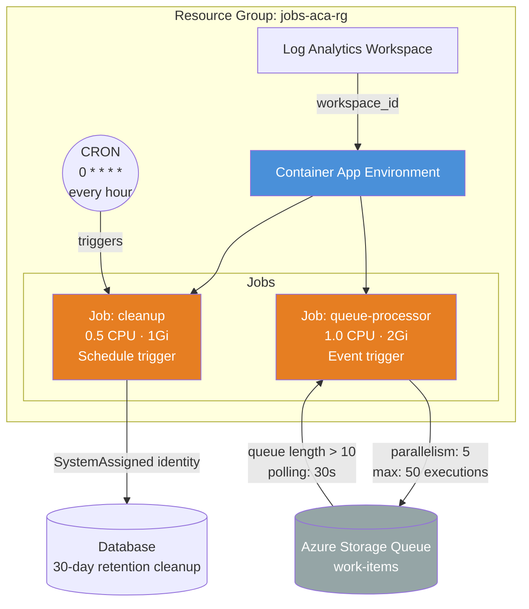

<p class="lead">
Deploys a jobs-only ACA environment with two Container App Jobs: a
CRON-scheduled cleanup job that runs hourly, and an event-driven queue
processor that scales based on Azure Storage Queue depth. No long-running
apps — just jobs.
</p>

## Architecture



## What This Example Demonstrates

- **Scheduled (CRON) jobs** — the `cleanup` job runs on a `0 * * * *` schedule (every hour) with parallelism of 1 and a 30-minute timeout.
- **Event-driven jobs** — the `queue-processor` job scales from 0 to 50 executions based on Azure Storage Queue depth, using KEDA scale rules with a queue-length threshold of 10.
- **Jobs-only environment** — `container_apps = {}` with a populated `jobs` map shows that ACA environments can run purely batch workloads with no long-running apps.
- **Secrets management** — database and queue connection strings are injected as secrets and referenced via `secret_name` in environment variables.
- **Managed identity** — both jobs use `SystemAssigned` identity for secure access to external resources.
- **Different trigger configurations** — demonstrates `schedule_trigger_config` and `event_trigger_config` side by side in the same module call.

## Configuration

```hcl
# Jobs Example — Terraform ACA Extension Layer
#
# Demonstrates Container App Jobs with:
# - Scheduled (CRON) job for periodic tasks
# - Event-driven job triggered by Azure Storage Queue
# - Different trigger configurations

terraform {
  required_version = ">= 1.5.0"

  required_providers {
    azurerm = {
      source  = "hashicorp/azurerm"
      version = ">= 4.0.0"
    }
    azapi = {
      source  = "Azure/azapi"
      version = ">= 2.0.0"
    }
  }
}

provider "azurerm" {
  features {}
}

provider "azapi" {}

# ---------------------------------------------------------------------------
# Resource Group
# ---------------------------------------------------------------------------

resource "azurerm_resource_group" "this" {
  name     = var.resource_group_name
  location = var.location
}

# ---------------------------------------------------------------------------
# ACA Module — Jobs
# ---------------------------------------------------------------------------

module "aca" {
  source = "../../"

  name                = var.name
  resource_group_name = azurerm_resource_group.this.name
  location            = azurerm_resource_group.this.location

  tags = {
    Pattern   = "Jobs"
    ManagedBy = "Terraform"
  }

  # Observability
  observability = {
    create_log_analytics_workspace = true
  }

  # Environment (default settings)
  environment = {}

  # No container apps — jobs only
  container_apps = {}

  # --- Jobs ---
  jobs = {

    # Scheduled job: runs every hour to clean up expired data
    cleanup = {
      replica_timeout_in_seconds = var.cleanup_timeout_seconds

      template = {
        containers = [
          {
            name   = "cleanup"
            image  = var.cleanup_job_image
            cpu    = 0.5
            memory = "1Gi"

            env = [
              { name = "DB_CONNECTION", secret_name = "db-connection-string" },
              { name = "RETENTION_DAYS", value = "30" },
            ]
          }
        ]
      }

      schedule_trigger_config = {
        cron_expression          = var.cleanup_cron_expression
        parallelism              = 1
        replica_completion_count = 1
      }

      secret = [
        {
          name  = "db-connection-string"
          value = var.db_connection_string
        }
      ]

      identity = {
        type = "SystemAssigned"
      }
    }

    # Event-driven job: processes messages from Azure Storage Queue
    queue-processor = {
      replica_timeout_in_seconds = var.queue_timeout_seconds
      replica_retry_limit        = var.queue_replica_retry_limit

      template = {
        containers = [
          {
            name   = "processor"
            image  = var.queue_processor_image
            cpu    = 1.0
            memory = "2Gi"

            env = [
              { name = "QUEUE_CONNECTION", secret_name = "queue-connection-string" },
              { name = "QUEUE_NAME", value = var.queue_name },
            ]
          }
        ]
      }

      event_trigger_config = {
        parallelism              = 5
        replica_completion_count = 1
        scale = {
          min_executions           = 0
          max_executions           = 50
          polling_interval_seconds = 30
          rules = [
            {
              name             = "azure-queue"
              type             = "azure-queue"
              custom_rule_type = "azure-queue"
              metadata = {
                queueName   = var.queue_name
                queueLength = "10"
                accountName = var.storage_account_name
              }
              authentication = [
                {
                  trigger_parameter = "connection"
                  secret_name       = "queue-connection-string"
                }
              ]
            }
          ]
        }
      }

      secret = [
        {
          name  = "queue-connection-string"
          value = var.queue_connection_string
        }
      ]

      identity = {
        type = "SystemAssigned"
      }
    }
  }
}
```

## Key Variables

| Name | Type | Default | Description |
|------|------|---------|-------------|
| `name` | `string` | `"jobs-aca"` | Base name for the jobs deployment. |
| `resource_group_name` | `string` | `"jobs-aca-rg"` | Name of the resource group to create. |
| `location` | `string` | `"eastus2"` | Azure region. |
| `cleanup_job_image` | `string` | `"mcr.microsoft.com/k8se/quickstart:latest"` | Container image for the cleanup job. |
| `queue_processor_image` | `string` | `"mcr.microsoft.com/k8se/quickstart:latest"` | Container image for the queue processor job. |
| `db_connection_string` | `string` | `""` | Database connection string for the cleanup job. **(sensitive)** |
| `queue_connection_string` | `string` | `""` | Azure Storage Queue connection string. **(sensitive)** |
| `queue_name` | `string` | `"work-items"` | Name of the Azure Storage Queue to process. |
| `storage_account_name` | `string` | `"mystorageaccount"` | Name of the Azure Storage Account. |
| `cleanup_cron_expression` | `string` | `"0 * * * *"` | CRON expression for the cleanup job schedule. |
| `cleanup_timeout_seconds` | `number` | `1800` | Maximum seconds a cleanup job replica may run. |
| `queue_timeout_seconds` | `number` | `600` | Maximum seconds a queue-processor job replica may run. |
| `queue_replica_retry_limit` | `number` | `3` | Maximum retry attempts for a failed queue-processor replica. |

## Deployment

```bash
# Initialize Terraform providers
terraform init

# Provide connection strings for the jobs
terraform apply \
  -var db_connection_string="Server=tcp:mydb.database.windows.net;..." \
  -var queue_connection_string="DefaultEndpointsProtocol=https;..." \
  -var storage_account_name="mystorageaccount"

# Check job details
terraform output cleanup_job
terraform output queue_processor_job

# Tear down all resources
terraform destroy
```

<div class="callout callout-warning">
<div class="callout-title">Warning</div>
The Azure Storage Queue referenced by the event-driven job <strong>must exist
before deploying</strong>. The KEDA scaler will fail to initialize if the queue
or storage account is not reachable. Create the queue in a separate Terraform
configuration or manually before applying this example.
</div>

<div class="callout callout-warning">
<div class="callout-title">Warning</div>
Connection strings contain secrets. Never commit them to source control. Use
<code>terraform.tfvars</code> (added to <code>.gitignore</code>) or environment
variables (<code>TF_VAR_db_connection_string</code>,
<code>TF_VAR_queue_connection_string</code>) instead.
</div>

<div class="callout callout-warning">
<div class="callout-title">Warning</div>
The CRON expression <code>0 * * * *</code> uses UTC by default. If your cleanup
logic is time-zone-sensitive, account for the UTC offset in either the CRON
expression or the application logic.
</div>
