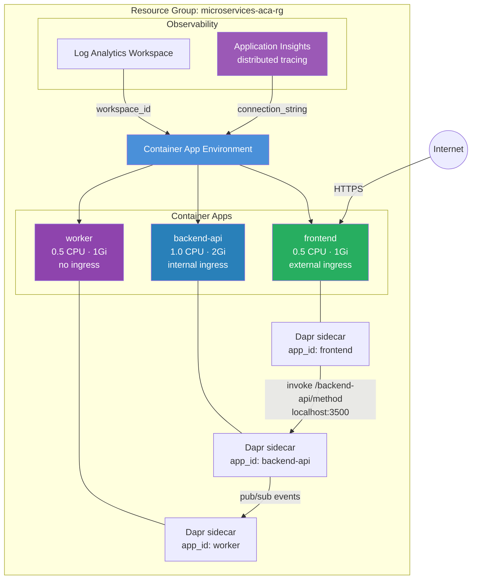

<p class="lead">
Deploys a three-tier microservices architecture on ACA: a public frontend, an
internal backend-api, and a background worker — all communicating via Dapr
service invocation and pub/sub. Application Insights provides end-to-end
distributed tracing across all three services.
</p>

## Architecture



## What This Example Demonstrates

- **Three-app microservices topology** — frontend (public), backend-api (internal), and worker (no ingress) defined in a single `container_apps` map block.
- **Dapr service invocation** — the frontend calls the backend-api via `http://localhost:3500/v1.0/invoke/backend-api/method/{endpoint}`, using Dapr's sidecar for service discovery and mTLS.
- **Dapr pub/sub** — the backend-api publishes events consumed by the worker, enabling async event-driven processing.
- **Mixed ingress modes** — external (frontend), internal (backend-api), and no ingress (worker) show all three ACA ingress patterns in one configuration.
- **Shared secrets** — the `db-connection-string` secret is defined on both the backend-api and worker, keeping secret definitions co-located with each app.
- **Managed identity** — the backend-api uses a `SystemAssigned` identity for secure access to databases and other Azure services.
- **Distributed tracing** — `create_application_insights = true` wires Application Insights into the environment, providing end-to-end trace correlation across all three services and their Dapr sidecars.
- **Independent scaling** — each app has its own min/max replica settings tuned for its workload pattern.

## Configuration

```hcl
# Microservices Example — Terraform ACA Extension Layer
#
# Demonstrates a microservices architecture with:
# - Multiple container apps (frontend, backend-api, worker)
# - Dapr for service-to-service communication
# - Internal and external ingress
# - Scaling rules
# - Shared secrets

terraform {
  required_version = ">= 1.5.0"

  required_providers {
    azurerm = {
      source  = "hashicorp/azurerm"
      version = ">= 4.0.0"
    }
    azapi = {
      source  = "Azure/azapi"
      version = ">= 2.0.0"
    }
  }
}

provider "azurerm" {
  features {}
}

provider "azapi" {}

# ---------------------------------------------------------------------------
# Resource Group
# ---------------------------------------------------------------------------

resource "azurerm_resource_group" "this" {
  name     = var.resource_group_name
  location = var.location
}

# ---------------------------------------------------------------------------
# ACA Module — Microservices
# ---------------------------------------------------------------------------

module "aca" {
  source = "../../"

  name                = var.name
  resource_group_name = azurerm_resource_group.this.name
  location            = azurerm_resource_group.this.location

  tags = {
    Pattern   = "Microservices"
    ManagedBy = "Terraform"
  }

  # Observability for distributed tracing
  observability = {
    create_log_analytics_workspace = true
    create_application_insights    = true
    application_insights_type      = "web"
  }

  # Environment with Dapr support (enabled by default on ACA environments)
  environment = {}

  # --- Container Apps ---
  container_apps = {

    # Frontend: Public-facing web app
    frontend = {
      revision_mode = "Single"

      template = {
        min_replicas = var.frontend_min_replicas
        max_replicas = var.frontend_max_replicas

        containers = [
          {
            name   = "frontend"
            image  = var.frontend_image
            cpu    = 0.5
            memory = "1Gi"

            env = [
              { name = "BACKEND_URL", value = "http://localhost:3500/v1.0/invoke/backend-api/method" },
            ]
          }
        ]
      }

      ingress = {
        external_enabled = true
        target_port      = var.frontend_port
        transport        = "http"
        traffic_weight = [
          { latest_revision = true, percentage = 100 }
        ]
      }

      dapr = {
        app_id       = "frontend"
        app_port     = var.frontend_port
        app_protocol = "http"
      }
    }

    # Backend API: Internal service accessed via Dapr
    backend-api = {
      revision_mode = "Single"

      template = {
        min_replicas = var.backend_api_min_replicas
        max_replicas = var.backend_api_max_replicas

        containers = [
          {
            name   = "backend-api"
            image  = var.backend_api_image
            cpu    = 1.0
            memory = "2Gi"

            env = [
              { name = "DB_CONNECTION", secret_name = "db-connection-string" },
              { name = "WORKER_APP_ID", value = "worker" },
            ]
          }
        ]
      }

      ingress = {
        external_enabled = false
        target_port      = var.backend_api_port
        transport        = "http"
      }

      dapr = {
        app_id       = "backend-api"
        app_port     = var.backend_api_port
        app_protocol = "http"
      }

      secret = [
        {
          name  = "db-connection-string"
          value = var.db_connection_string
        }
      ]

      identity = {
        type = "SystemAssigned"
      }
    }

    # Worker: Background processor accessed via Dapr pub/sub
    worker = {
      revision_mode = "Single"

      template = {
        min_replicas = var.worker_min_replicas
        max_replicas = var.worker_max_replicas

        containers = [
          {
            name   = "worker"
            image  = var.worker_image
            cpu    = 0.5
            memory = "1Gi"

            env = [
              { name = "DB_CONNECTION", secret_name = "db-connection-string" },
            ]
          }
        ]
      }

      # No external ingress — only accessible via Dapr
      dapr = {
        app_id       = "worker"
        app_port     = var.worker_port
        app_protocol = "http"
      }

      secret = [
        {
          name  = "db-connection-string"
          value = var.db_connection_string
        }
      ]
    }
  }
}
```

## Key Variables

| Name | Type | Default | Description |
|------|------|---------|-------------|
| `name` | `string` | `"microservices-aca"` | Base name for the microservices deployment. |
| `resource_group_name` | `string` | `"microservices-aca-rg"` | Name of the resource group to create. |
| `location` | `string` | `"eastus2"` | Azure region. |
| `frontend_image` | `string` | `"mcr.microsoft.com/k8se/quickstart:latest"` | Container image for the frontend app. |
| `backend_api_image` | `string` | `"mcr.microsoft.com/k8se/quickstart:latest"` | Container image for the backend API. |
| `worker_image` | `string` | `"mcr.microsoft.com/k8se/quickstart:latest"` | Container image for the worker. |
| `db_connection_string` | `string` | — | Database connection string. **(required, sensitive)** |
| `frontend_port` | `number` | `80` | Port the frontend container listens on. |
| `backend_api_port` | `number` | `80` | Port the backend API container listens on. |
| `worker_port` | `number` | `80` | Port the worker container listens on (for Dapr). |
| `frontend_min_replicas` | `number` | `1` | Minimum replicas for the frontend app. |
| `frontend_max_replicas` | `number` | `5` | Maximum replicas for the frontend app. |
| `backend_api_min_replicas` | `number` | `2` | Minimum replicas for the backend API. |
| `backend_api_max_replicas` | `number` | `10` | Maximum replicas for the backend API. |
| `worker_min_replicas` | `number` | `1` | Minimum replicas for the worker. |
| `worker_max_replicas` | `number` | `20` | Maximum replicas for the worker. |

## Deployment

```bash
# Initialize Terraform providers
terraform init

# Required: provide a database connection string
terraform apply -var db_connection_string="Server=tcp:mydb.database.windows.net;..."

# Get the public frontend URL
terraform output frontend_url

# Tear down all resources
terraform destroy
```

<div class="callout callout-warning">
<div class="callout-title">Warning</div>
The <code>db_connection_string</code> variable has no default and is
<strong>required</strong>. Do not commit real connection strings to source
control — use <code>terraform.tfvars</code> (gitignored) or environment
variables (<code>TF_VAR_db_connection_string</code>).
</div>

<div class="callout callout-warning">
<div class="callout-title">Warning</div>
Dapr service invocation uses <code>localhost:3500</code> as the sidecar address.
If your app tries to call <code>backend-api</code> directly by hostname instead
of through the Dapr sidecar URL, the call will fail. Always use the Dapr invoke
URL pattern: <code>http://localhost:3500/v1.0/invoke/{app-id}/method/{endpoint}</code>.
</div>

<div class="callout callout-warning">
<div class="callout-title">Warning</div>
The worker app has <strong>no ingress</strong> configured — it is only reachable
via Dapr pub/sub. If you need to expose a health-check or admin endpoint on the
worker, add an <code>ingress</code> block with <code>external_enabled = false</code>
for internal-only access.
</div>
