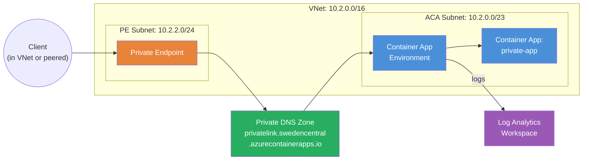

<p class="lead">
  Deploy a <strong>private endpoint</strong> for an Azure Container Apps
  environment to restrict access to a corporate VNet with no public internet
  exposure. Private endpoints for ACA environments went GA in API version
  <code>2025-07-01</code> but are <strong>not yet available</strong> in the
  AzureRM Terraform provider — this example shows how to combine the module's
  sub-modules with direct <code>azurerm_private_endpoint</code> resources.
</p>

## Architecture



## What This Example Demonstrates

- **Private endpoint for ACA** — assigns a private IP from your VNet to the ACA environment, making it accessible only through the private network.
- **Sub-module composition pattern** — orchestrates VNet, environment, private DNS zone, private endpoint, and container app in a specific dependency order.
- **Internal load balancer** — the environment is created with `internal_load_balancer_enabled = true`, required for private endpoint support.
- **Private DNS zone resolution** — `privatelink.<region>.azurecontainerapps.io` with VNet link for automatic DNS resolution.
- **Workload profiles** — private endpoints require a workload profiles environment (Consumption profile configured).
- **Network layout** — two subnets: `/23` for the ACA environment (minimum requirement) and `/24` for the private endpoint NIC.

## Configuration

```hcl
# Private Endpoint Example — Terraform ACA Extension Layer
#
# Demonstrates private endpoint for ACA environment via azurerm_private_endpoint.
# Private endpoints for ACA environments just went GA in API 2025-07-01 but are
# NOT yet in the AzureRM provider. This example uses the sub-module composition
# pattern (like the storage example) so we can create the VNet, environment,
# private endpoint, private DNS zone, and container app in the correct order.

terraform {
  required_version = ">= 1.5.0"

  required_providers {
    azurerm = {
      source  = "hashicorp/azurerm"
      version = ">= 4.0.0"
    }
    azapi = {
      source  = "Azure/azapi"
      version = ">= 2.0.0"
    }
  }
}

provider "azurerm" {
  features {}
}

provider "azapi" {}

locals {
  tags = {
    environment = "dev"
    managed_by  = "terraform"
    pattern     = "PrivateEndpoint"
  }
}

# ---------------------------------------------------------------------------
# Resource Group
# ---------------------------------------------------------------------------

resource "azurerm_resource_group" "this" {
  name     = var.resource_group_name
  location = var.location
  tags     = local.tags
}

# ---------------------------------------------------------------------------
# Virtual Network + Subnets
# ---------------------------------------------------------------------------

resource "azurerm_virtual_network" "this" {
  name                = "${var.name}-vnet"
  location            = azurerm_resource_group.this.location
  resource_group_name = azurerm_resource_group.this.name
  address_space       = ["10.2.0.0/16"]
  tags                = local.tags
}

resource "azurerm_subnet" "aca" {
  name                 = "aca-subnet"
  resource_group_name  = azurerm_resource_group.this.name
  virtual_network_name = azurerm_virtual_network.this.name
  address_prefixes     = ["10.2.0.0/23"]

  # Workload profiles environments require pre-delegation
  delegation {
    name = "aca-delegation"
    service_delegation {
      name    = "Microsoft.App/environments"
      actions = ["Microsoft.Network/virtualNetworks/subnets/join/action"]
    }
  }

  lifecycle {
    ignore_changes = [delegation]
  }
}

resource "azurerm_subnet" "pe" {
  name                 = "pe-subnet"
  resource_group_name  = azurerm_resource_group.this.name
  virtual_network_name = azurerm_virtual_network.this.name
  address_prefixes     = ["10.2.2.0/24"]
}

# ---------------------------------------------------------------------------
# Observability
# ---------------------------------------------------------------------------

module "observability" {
  source = "../../modules/observability"

  name_prefix         = var.name
  resource_group_name = azurerm_resource_group.this.name
  location            = azurerm_resource_group.this.location

  create_log_analytics_workspace = true
  tags                           = local.tags
}

# ---------------------------------------------------------------------------
# ACA Environment (internal load balancer for private access)
# ---------------------------------------------------------------------------

module "environment" {
  source = "../../modules/container_app_environment"

  name                           = var.name
  resource_group_name            = azurerm_resource_group.this.name
  location                       = azurerm_resource_group.this.location
  log_analytics_workspace_id     = module.observability.log_analytics_workspace_id
  infrastructure_subnet_id       = azurerm_subnet.aca.id
  internal_load_balancer_enabled = true
  tags                           = local.tags

  # Private endpoints require a workload profiles environment
  workload_profile = [{
    name                  = "Consumption"
    workload_profile_type = "Consumption"
    minimum_count         = 0
    maximum_count         = 0
  }]
}

# ---------------------------------------------------------------------------
# Private DNS Zone + VNet Link
# ---------------------------------------------------------------------------

resource "azurerm_private_dns_zone" "aca" {
  name                = "privatelink.${var.location}.azurecontainerapps.io"
  resource_group_name = azurerm_resource_group.this.name
  tags                = local.tags
}

resource "azurerm_private_dns_zone_virtual_network_link" "aca" {
  name                  = "${var.name}-dns-link"
  resource_group_name   = azurerm_resource_group.this.name
  private_dns_zone_name = azurerm_private_dns_zone.aca.name
  virtual_network_id    = azurerm_virtual_network.this.id
  registration_enabled  = false
  tags                  = local.tags
}

# ---------------------------------------------------------------------------
# Private Endpoint for ACA Environment
# ---------------------------------------------------------------------------

resource "azurerm_private_endpoint" "aca" {
  name                = "${var.name}-pe"
  location            = azurerm_resource_group.this.location
  resource_group_name = azurerm_resource_group.this.name
  subnet_id           = azurerm_subnet.pe.id
  tags                = local.tags

  private_service_connection {
    name                           = "${var.name}-psc"
    private_connection_resource_id = module.environment.id
    subresource_names              = ["managedEnvironments"]
    is_manual_connection           = false
  }

  private_dns_zone_group {
    name                 = "default"
    private_dns_zone_ids = [azurerm_private_dns_zone.aca.id]
  }
}

# ---------------------------------------------------------------------------
# Container App (internal ingress only — accessible via private endpoint)
# ---------------------------------------------------------------------------

module "container_app" {
  source = "../../modules/container_app"

  name                         = "${var.name}-app"
  resource_group_name          = azurerm_resource_group.this.name
  container_app_environment_id = module.environment.id
  revision_mode                = "Single"

  template = {
    min_replicas = 1
    max_replicas = 3

    containers = [{
      name   = "private-app"
      image  = var.container_image
      cpu    = 0.25
      memory = "0.5Gi"

      env = [
        { name = "NETWORK_MODE", value = "private" },
      ]
    }]
  }

  ingress = {
    external_enabled = false
    target_port      = 80
    transport        = "auto"
    traffic_weight = [
      { latest_revision = true, percentage = 100 }
    ]
  }

  tags = local.tags

  depends_on = [azurerm_private_endpoint.aca]
}
```

## Key Variables

| Name | Type | Default | Description |
|---|---|---|---|
| `name` | `string` | `"aca-private"` | Base name for the deployment |
| `resource_group_name` | `string` | `"tf-aca-8"` | Name of the resource group to create |
| `location` | `string` | `"swedencentral"` | Azure region |
| `container_image` | `string` | `"mcr.microsoft.com/azuredocs/containerapps-helloworld:latest"` | Container image for the private app |

## Deployment

```bash
# Initialise Terraform and download providers
terraform init

# Preview the infrastructure changes
terraform plan

# Apply — creates VNet, subnets, environment, private endpoint, DNS zone, and container app
terraform apply

# Verify the private endpoint IP
terraform output private_endpoint_ip

# Test from a VM in the same VNet or peered network
curl https://$(terraform output -raw app_fqdn)

# Tear down all resources when finished
terraform destroy
```

<div class="callout callout-warning">
  <div class="callout-title">Warning</div>
  The ACA environment subnet must be at least <code>/23</code> (512 addresses). A smaller CIDR will cause the environment provisioning to fail.
</div>

<div class="callout callout-warning">
  <div class="callout-title">Warning</div>
  Private endpoints require a <strong>workload profiles</strong> environment. The example configures a Consumption workload profile — without this, the private endpoint connection will be rejected.
</div>

<div class="callout callout-warning">
  <div class="callout-title">Warning</div>
  After deployment the container app is <strong>not accessible from the public internet</strong>. You must test from a VM, bastion host, or peered network within the same VNet. The private DNS zone handles name resolution automatically for resources linked to the VNet.
</div>
