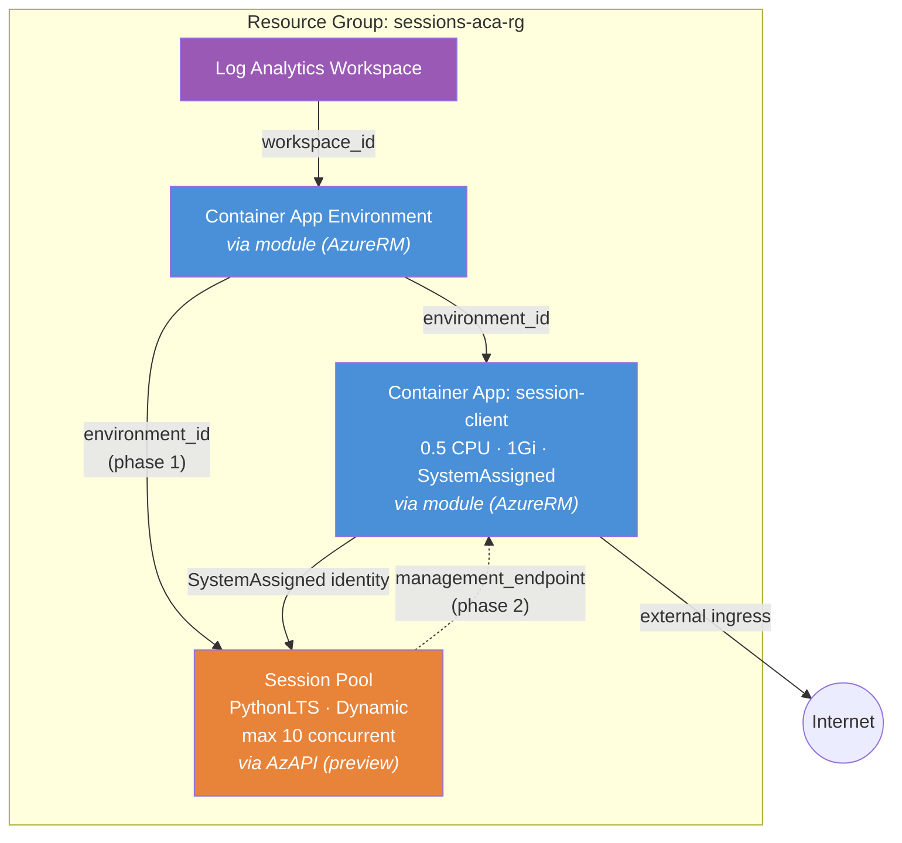

<p class="lead">
Demonstrates the module's hybrid provider strategy: the ACA environment and
client app are created via AzureRM, while a Dynamic Sessions pool (Python code
interpreter) is created directly via AzAPI using the
<code>2024-10-02-preview</code> API. This is the key example for understanding
the AzAPI overlay pattern.
</p>

## Architecture



**Blue** = AzureRM resources (stable) · **Orange** = AzAPI resources (preview)

## What This Example Demonstrates

- **Hybrid provider strategy** — AzureRM for stable resources (environment, app) and AzAPI for preview resources (`Microsoft.App/sessionPools`) that aren't yet in the AzureRM provider.
- **AzAPI overlay pattern** — the session pool is created as an `azapi_resource` that consumes the module's `environment_id` output, showing how to extend the module with preview features.
- **Two-phase deployment** — the session pool needs `environment_id` (from phase 1), and the client app needs the pool's `management_endpoint` (wired in phase 2 via a variable).
- **Dynamic Sessions** — a `PythonLTS` code interpreter pool with configurable concurrency (`max_concurrent_sessions`) and pre-warmed instances (`ready_session_instances`).
- **Managed identity** — the client app uses `SystemAssigned` identity to authenticate against the session pool's management API.
- **Preview API versioning** — the `2024-10-02-preview` API version is pinned on the AzAPI resource, demonstrating how to target specific preview APIs.

## Configuration

```hcl
# Dynamic Sessions Example — Terraform ACA Extension Layer
#
# Demonstrates ACA Dynamic Sessions (code interpreter) with:
# - Session pool via AzAPI (not yet in AzureRM)
# - Python code interpreter session type
# - Container app that interacts with sessions

terraform {
  required_version = ">= 1.5.0"

  required_providers {
    azurerm = {
      source  = "hashicorp/azurerm"
      version = ">= 4.0.0"
    }
    azapi = {
      source  = "Azure/azapi"
      version = ">= 2.0.0"
    }
  }
}

provider "azurerm" {
  features {}
}

provider "azapi" {}

# ---------------------------------------------------------------------------
# Resource Group
# ---------------------------------------------------------------------------

resource "azurerm_resource_group" "this" {
  name     = var.resource_group_name
  location = var.location
}

# ---------------------------------------------------------------------------
# ACA Module — Environment + App
# ---------------------------------------------------------------------------

module "aca" {
  source = "../../"

  name                = var.name
  resource_group_name = azurerm_resource_group.this.name
  location            = azurerm_resource_group.this.location

  tags = {
    Pattern   = "DynamicSessions"
    ManagedBy = "Terraform"
  }

  observability = {
    create_log_analytics_workspace = true
  }

  environment = {}

  container_apps = {
    session-client = {
      revision_mode = "Single"

      template = {
        min_replicas = 1
        max_replicas = 3

        containers = [
          {
            name   = "client"
            image  = "mcr.microsoft.com/azuredocs/containerapps-helloworld:latest"
            cpu    = 0.5
            memory = "1Gi"

            env = [
              # SESSION_POOL_ENDPOINT: set var.session_pool_endpoint to the
              # session_pool_management_endpoint output after the first apply.
              # A direct reference to azapi_resource.session_pool.output would
              # create a circular dependency (pool depends on environment_id).
              { name = "SESSION_POOL_ENDPOINT", value = var.session_pool_endpoint },
            ]
          }
        ]
      }

      ingress = {
        external_enabled = true
        target_port      = 80
        transport        = "auto"
        traffic_weight = [
          { latest_revision = true, percentage = 100 }
        ]
      }

      identity = {
        type = "SystemAssigned"
      }
    }
  }
}

# ---------------------------------------------------------------------------
# Dynamic Sessions Pool (AzAPI — not yet supported in AzureRM)
# ---------------------------------------------------------------------------

resource "azapi_resource" "session_pool" {
  type      = "Microsoft.App/sessionPools@2024-10-02-preview"
  name      = replace("${var.name}sessions", "-", "")
  location  = azurerm_resource_group.this.location
  parent_id = azurerm_resource_group.this.id

  body = {
    properties = {
      environmentId      = module.aca.environment_id
      poolManagementType = "Dynamic"
      containerType      = "PythonLTS"
      scaleConfiguration = {
        maxConcurrentSessions = var.max_concurrent_sessions
        readySessionInstances = var.ready_session_instances
      }
      dynamicPoolConfiguration = {
        executionType           = "Timed"
        cooldownPeriodInSeconds = 300
      }
    }
  }

  response_export_values = ["properties.poolManagementEndpoint"]

  tags = {
    Pattern   = "DynamicSessions"
    ManagedBy = "Terraform"
  }
}
```

## Key Variables

| Name | Type | Default | Description |
|------|------|---------|-------------|
| `name` | `string` | `"sessions-aca"` | Base name for the sessions deployment. |
| `resource_group_name` | `string` | `"sessions-aca-rg"` | Name of the resource group to create. |
| `location` | `string` | `"eastus2"` | Azure region. Must support ACA dynamic sessions. |
| `max_concurrent_sessions` | `number` | `10` | Maximum concurrent sessions in the pool. |
| `ready_session_instances` | `number` | `1` | Number of pre-warmed session instances. |
| `session_pool_endpoint` | `string` | `""` | Pool management endpoint (set after phase 1). **(sensitive)** |

## Deployment

```bash
# Initialize Terraform providers
terraform init

# Phase 1: Create environment, app, and session pool
terraform apply

# Phase 2: Wire the pool endpoint into the client app
ENDPOINT=$(terraform output -raw session_pool_management_endpoint)
terraform apply -var session_pool_endpoint="$ENDPOINT"

# Verify the client app has the endpoint
terraform output client_app_name

# Tear down all resources
terraform destroy
```

<div class="callout callout-warning">
<div class="callout-title">Warning</div>
This example requires a <strong>two-phase deploy</strong>. The first
<code>terraform apply</code> creates the environment, app, and session pool —
but the client app's <code>SESSION_POOL_ENDPOINT</code> will be empty. You must
run a second <code>terraform apply</code> with the pool endpoint output to
complete the wiring. Skipping phase 2 means the client app cannot reach the
session pool.
</div>

<div class="callout callout-warning">
<div class="callout-title">Warning</div>
Dynamic Sessions (<code>Microsoft.App/sessionPools</code>) is a <strong>preview
feature</strong> and is <strong>not available in all Azure regions</strong>. Check
<a href="https://learn.microsoft.com/azure/container-apps/sessions">Azure
Container Apps sessions documentation</a> for region availability before
deploying. The default region <code>eastus2</code> supports this feature.
</div>

<div class="callout callout-warning">
<div class="callout-title">Warning</div>
The AzAPI resource uses the <code>2024-10-02-preview</code> API version. Preview
APIs may introduce breaking changes between versions. Pin the API version in your
configuration and test thoroughly before upgrading to a newer preview or GA
version.
</div>
