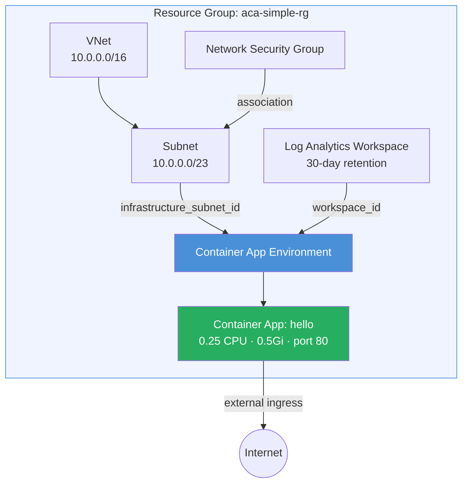

<p class="lead">
Deploys a minimal Azure Container Apps environment with a single public-facing
hello-world container app. One module call, ~30 lines of config, and you have a
VNet-integrated environment with logging and a publicly accessible app — the
fastest way to get a container running on ACA.
</p>

## Architecture



## What This Example Demonstrates

- **Single-module deployment** — one `module "aca"` call provisions the entire stack (VNet, subnet, NSG, Log Analytics, environment, and app).
- **VNet integration** — the container app environment is wired to a dedicated `/23` subnet with an associated NSG.
- **Observability out of the box** — Log Analytics Workspace with 30-day retention is created automatically.
- **External ingress** — the `hello` app is publicly accessible via an auto-generated FQDN.
- **Scaling defaults** — min replicas `0` (scale to zero) and max replicas `3` are configured, showing ACA's built-in auto-scaling.
- **Minimal boilerplate** — replaces ~120 lines of raw `azurerm` resources with ~30 lines of module configuration.

## Configuration

```hcl
terraform {
  required_version = ">= 1.5.0"

  required_providers {
    azurerm = {
      source  = "hashicorp/azurerm"
      version = ">= 4.0.0"
    }
  }
}

provider "azurerm" {
  features {}
}

# ---------------------------------------------------------------------------
# Resource Group
# ---------------------------------------------------------------------------

resource "azurerm_resource_group" "this" {
  name     = var.resource_group_name
  location = var.location
  tags     = var.tags
}

# ---------------------------------------------------------------------------
# ACA Module
# ---------------------------------------------------------------------------

module "aca" {
  source = "../../"

  name                = var.name
  resource_group_name = azurerm_resource_group.this.name
  location            = azurerm_resource_group.this.location
  tags                = var.tags

  networking = {
    vnet_address_space        = var.vnet_address_space
    aca_subnet_address_prefix = var.aca_subnet_address_prefix
  }

  observability = {
    log_analytics_retention_in_days = 30
  }

  container_apps = {
    hello = {
      revision_mode = "Single"
      template = {
        containers = [{
          name   = "hello"
          image  = var.container_image
          cpu    = 0.25
          memory = "0.5Gi"
        }]
        max_replicas = var.max_replicas
        min_replicas = var.min_replicas
      }
      ingress = {
        external_enabled = true
        target_port      = var.container_port
        transport        = "auto"
        traffic_weight = [{
          latest_revision = true
          percentage      = 100
        }]
      }
    }
  }
}
```

## Key Variables

| Name | Type | Default | Description |
|------|------|---------|-------------|
| `name` | `string` | `"aca-simple"` | Base name for the deployment. |
| `resource_group_name` | `string` | `"aca-simple-rg"` | Name of the resource group to create. |
| `location` | `string` | `"eastus2"` | Azure region. |
| `container_image` | `string` | `"mcr.microsoft.com/azuredocs/containerapps-helloworld:latest"` | Container image for the hello-world app. |
| `vnet_address_space` | `list(string)` | `["10.0.0.0/16"]` | Address space for the VNet. |
| `aca_subnet_address_prefix` | `string` | `"10.0.0.0/23"` | Subnet CIDR for the ACA environment (must be /23 or larger). |
| `container_port` | `number` | `80` | Port the container listens on. |
| `min_replicas` | `number` | `0` | Minimum number of container replicas. |
| `max_replicas` | `number` | `3` | Maximum number of container replicas. |
| `tags` | `map(string)` | `{environment="dev", managed_by="terraform"}` | Tags for all resources. |

## Deployment

```bash
# Initialize Terraform providers
terraform init

# Preview the deployment
terraform plan -out=tfplan

# Apply the configuration
terraform apply tfplan

# Get the app URL
terraform output app_urls

# Override defaults
terraform apply -var name=my-app -var resource_group_name=my-app-rg

# Tear down all resources
terraform destroy
```

<div class="callout callout-warning">
<div class="callout-title">Warning</div>
The ACA subnet must be <code>/23</code> or larger. Smaller subnets will fail
validation because Azure Container Apps reserves a significant number of IPs for
infrastructure. The default <code>10.0.0.0/23</code> provides 512 addresses.
</div>

<div class="callout callout-warning">
<div class="callout-title">Warning</div>
With <code>min_replicas = 0</code> the app can scale to zero when idle. The first
request after a cold start will experience higher latency (cold-start penalty).
Set <code>min_replicas = 1</code> in production to keep at least one instance warm.
</div>
