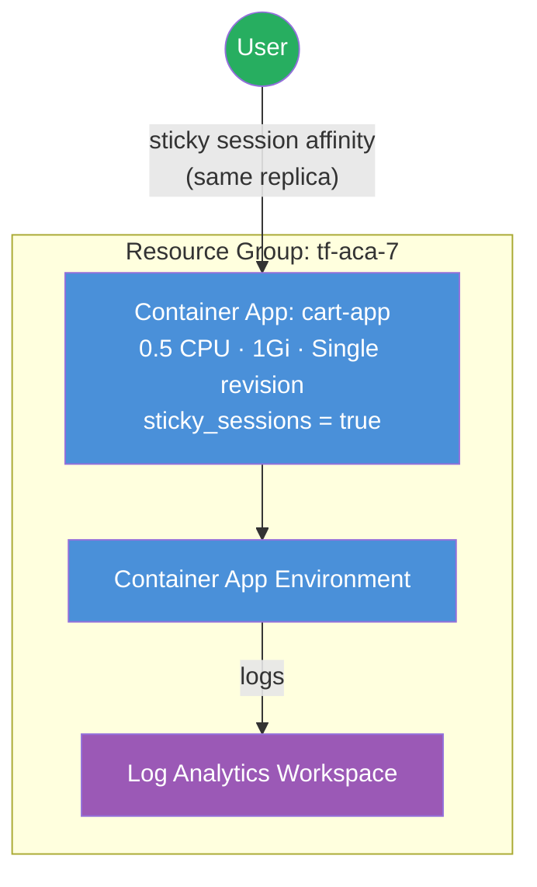

<p class="lead">
  Enable <strong>sticky session affinity</strong> for Azure Container Apps — the
  #1 missing feature from the AzureRM provider. This example uses the module's
  <code>feature_flags</code> pattern to apply sticky sessions through
  <strong>AzAPI</strong> while keeping every other resource on AzureRM.
</p>

## Architecture



## What This Example Demonstrates

- **`feature_flags` pattern** — a single `sticky_sessions = true` flag on a container app triggers an AzAPI overlay that patches the ingress configuration with session affinity.
- **AzAPI overlay for missing AzureRM features** — sticky sessions reached GA in May 2023, yet AzureRM still has no native support after 670+ days. The module fills this gap with `azapi_update_resource`.
- **Zero app-level changes on migration** — when AzureRM eventually adds native sticky sessions support, flip the provider override and remove the flag without touching app configuration.
- **Stateful workload support** — shopping carts, form wizards, and WebSocket connections that require subsequent requests from the same client to route to the same replica.

## Configuration

```hcl
# Sticky Sessions Example — Terraform ACA Extension Layer
#
# Demonstrates sticky sessions via AzAPI overlay — the #1 missing feature
# from azurerm (GA since May 2023, 670+ days without provider support).
# Uses the module's feature_flags pattern to apply sticky session affinity
# through AzAPI while keeping everything else on AzureRM.

terraform {
  required_version = ">= 1.5.0"

  required_providers {
    azurerm = {
      source  = "hashicorp/azurerm"
      version = ">= 4.0.0"
    }
    azapi = {
      source  = "Azure/azapi"
      version = ">= 2.0.0"
    }
  }
}

provider "azurerm" {
  features {}
}

provider "azapi" {}

# ---------------------------------------------------------------------------
# Resource Group
# ---------------------------------------------------------------------------

resource "azurerm_resource_group" "this" {
  name     = var.resource_group_name
  location = var.location
  tags     = var.tags
}

# ---------------------------------------------------------------------------
# ACA Module — Environment + Cart App with Sticky Sessions
# ---------------------------------------------------------------------------

module "aca" {
  source = "../../"

  name                = var.name
  resource_group_name = azurerm_resource_group.this.name
  location            = azurerm_resource_group.this.location
  tags                = var.tags

  observability = {
    create_log_analytics_workspace = true
  }

  container_apps = {
    cart = {
      revision_mode = "Single"

      template = {
        min_replicas = 1
        max_replicas = 5

        containers = [{
          name   = "cart-app"
          image  = var.container_image
          cpu    = 0.5
          memory = "1Gi"

          env = [
            { name = "SESSION_STORE", value = "in-memory" },
          ]
        }]
      }

      ingress = {
        external_enabled = true
        target_port      = 80
        transport        = "auto"
        traffic_weight = [{ latest_revision = true, percentage = 100 }]
      }

      feature_flags = {
        sticky_sessions = true
      }
    }
  }
}
```

## Key Variables

| Name | Type | Default | Description |
|---|---|---|---|
| `name` | `string` | `"aca-sticky"` | Base name for the deployment |
| `resource_group_name` | `string` | `"tf-aca-7"` | Name of the resource group to create |
| `location` | `string` | `"swedencentral"` | Azure region |
| `tags` | `map(string)` | `{ environment = "dev", ... }` | Tags for all resources |
| `container_image` | `string` | `"mcr.microsoft.com/azuredocs/containerapps-helloworld:latest"` | Container image for the cart app |

## Deployment

```bash
# Initialise Terraform and download providers
terraform init

# Preview the infrastructure changes
terraform plan

# Apply — creates the environment, cart app, and AzAPI sticky sessions overlay
terraform apply

# Verify sticky sessions are enabled (check the affinity cookie in responses)
curl -v $(terraform output -raw cart_app_url)

# Tear down all resources when finished
terraform destroy
```

<div class="callout callout-warning">
  <div class="callout-title">Warning</div>
  Sticky sessions rely on an <code>affinity</code> cookie set by the ACA ingress. Clients that do not support cookies (e.g. raw HTTP clients without a cookie jar) will not benefit from session affinity.
</div>

<div class="callout callout-warning">
  <div class="callout-title">Warning</div>
  The AzAPI overlay sets <code>stickySessions.affinity</code> to <code>"sticky"</code> on the Container App's ingress. If you modify ingress settings through the Azure Portal or CLI, the overlay may be overwritten on the next <code>terraform apply</code>.
</div>
