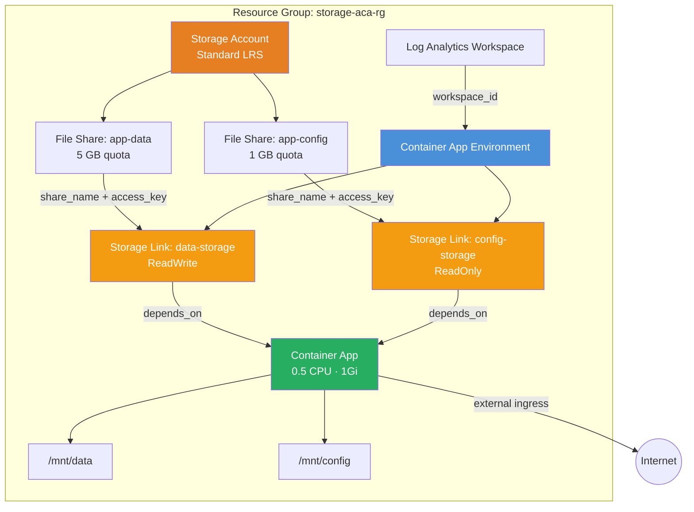

<p class="lead">
  Mount Azure Files SMB shares into a Container App using environment storage
  links. This example uses <strong>sub-modules directly</strong> instead of the
  root module, showing how to compose the module's building blocks for advanced
  scenarios where resources must be created between the environment and apps.
</p>

## Architecture



## What This Example Demonstrates

- **Sub-module composability** — calls `modules/observability`, `modules/container_app_environment`, and `modules/container_app` individually instead of the root module, giving full control over resource ordering.
- **Azure Files SMB volumes** — provisions a Storage Account with two File Shares (`app-data` read-write, `app-config` read-only) and links them to the ACA environment.
- **Explicit dependency chain** — `Storage Account → File Shares → Environment Storage Links → Container App` ensures Terraform creates resources in the correct order.
- **Multiple volume mounts** — the container mounts two volumes at `/mnt/data` and `/mnt/config` with different access modes.
- **Pattern for injection points** — generalises to any scenario requiring resources between the environment and apps (custom domains, Dapr components, certificates).

## Configuration

```hcl
# SMB Storage Example — Terraform ACA Extension Layer
#
# Demonstrates Azure Files SMB shares mounted in container apps:
# - Azure Storage Account with File Share
# - ACA environment storage link
# - Container app with mounted volume
#
# Uses sub-modules directly so that environment storage links are created
# BEFORE the container app that references them.

terraform {
  required_version = ">= 1.5.0"

  required_providers {
    azurerm = {
      source  = "hashicorp/azurerm"
      version = ">= 4.0.0"
    }
    azapi = {
      source  = "Azure/azapi"
      version = ">= 2.0.0"
    }
  }
}

provider "azurerm" {
  features {}
}

provider "azapi" {}

locals {
  tags = {
    Pattern   = "SMBStorage"
    ManagedBy = "Terraform"
  }
}

# ---------------------------------------------------------------------------
# Resource Group
# ---------------------------------------------------------------------------

resource "azurerm_resource_group" "this" {
  name     = var.resource_group_name
  location = var.location
}

# ---------------------------------------------------------------------------
# Storage Account + File Share
# ---------------------------------------------------------------------------

resource "azurerm_storage_account" "this" {
  name                            = var.storage_account_name
  resource_group_name             = azurerm_resource_group.this.name
  location                        = azurerm_resource_group.this.location
  account_tier                    = "Standard"
  account_replication_type        = "LRS"
  allow_nested_items_to_be_public = false
  tags                            = local.tags

  # Production: change default_action to "Deny" and add ip_rules / virtual_network_subnet_ids
  # to restrict access to the ACA environment's outbound IPs only.
  network_rules {
    default_action = "Allow"
  }
}

resource "azurerm_storage_share" "data" {
  name               = "app-data"
  storage_account_id = azurerm_storage_account.this.id
  quota              = var.share_quota_gb
}

resource "azurerm_storage_share" "config" {
  name               = "app-config"
  storage_account_id = azurerm_storage_account.this.id
  quota              = 1
}

# ---------------------------------------------------------------------------
# Observability
# ---------------------------------------------------------------------------

module "observability" {
  source = "../../modules/observability"

  name_prefix         = var.name
  resource_group_name = azurerm_resource_group.this.name
  location            = azurerm_resource_group.this.location

  create_log_analytics_workspace = true
  tags                           = local.tags
}

# ---------------------------------------------------------------------------
# ACA Environment
# ---------------------------------------------------------------------------

module "environment" {
  source = "../../modules/container_app_environment"

  name                       = var.name
  resource_group_name        = azurerm_resource_group.this.name
  location                   = azurerm_resource_group.this.location
  log_analytics_workspace_id = module.observability.log_analytics_workspace_id
  tags                       = local.tags
}

# ---------------------------------------------------------------------------
# ACA Environment Storage Links (must exist before the container app)
# ---------------------------------------------------------------------------

resource "azurerm_container_app_environment_storage" "data" {
  name                         = "data-storage"
  container_app_environment_id = module.environment.id
  account_name                 = azurerm_storage_account.this.name
  share_name                   = azurerm_storage_share.data.name
  access_key                   = azurerm_storage_account.this.primary_access_key
  access_mode                  = "ReadWrite"
}

resource "azurerm_container_app_environment_storage" "config" {
  name                         = "config-storage"
  container_app_environment_id = module.environment.id
  account_name                 = azurerm_storage_account.this.name
  share_name                   = azurerm_storage_share.config.name
  access_key                   = azurerm_storage_account.this.primary_access_key
  access_mode                  = "ReadOnly"
}

# ---------------------------------------------------------------------------
# Container App (depends on storage links being ready)
# ---------------------------------------------------------------------------

module "container_app" {
  source = "../../modules/container_app"

  depends_on = [
    azurerm_container_app_environment_storage.data,
    azurerm_container_app_environment_storage.config,
  ]

  name                         = "${var.name}-app-with-storage"
  resource_group_name          = azurerm_resource_group.this.name
  container_app_environment_id = module.environment.id
  revision_mode                = "Single"

  template = {
    min_replicas = 1
    max_replicas = 3

    containers = [
      {
        name   = "app"
        image  = "mcr.microsoft.com/azuredocs/containerapps-helloworld:latest"
        cpu    = 0.5
        memory = "1Gi"

        env = [
          { name = "DATA_PATH", value = "/mnt/data" },
          { name = "CONFIG_PATH", value = "/mnt/config" },
        ]

        volume_mounts = [
          { name = "data-volume", path = "/mnt/data" },
          { name = "config-volume", path = "/mnt/config" },
        ]
      }
    ]

    volumes = [
      {
        name         = "data-volume"
        storage_type = "AzureFile"
        storage_name = "data-storage"
      },
      {
        name         = "config-volume"
        storage_type = "AzureFile"
        storage_name = "config-storage"
      },
    ]
  }

  ingress = {
    external_enabled = true
    target_port      = 80
    transport        = "auto"
    traffic_weight = [
      { latest_revision = true, percentage = 100 }
    ]
  }

  tags = local.tags
}
```

## Key Variables

| Name | Type | Default | Description |
|---|---|---|---|
| `name` | `string` | `"storage-aca"` | Base name for the deployment |
| `resource_group_name` | `string` | `"storage-aca-rg"` | Name of the resource group to create |
| `location` | `string` | `"eastus2"` | Azure region |
| `storage_account_name` | `string` | `"tfaca6stordata"` | Name of the Azure Storage Account (must be globally unique, 3–24 lowercase alphanumeric) |
| `share_quota_gb` | `number` | `5` | Quota in GB for the data file share |

## Deployment

```bash
# Initialise Terraform and download providers
terraform init

# Preview the infrastructure changes
terraform plan -var storage_account_name=<unique-name>

# Apply — creates ~9 resources
terraform apply -var storage_account_name=<unique-name>

# Verify the deployed app and storage account
terraform output app_name
terraform output storage_account_name

# Tear down all resources when finished
terraform destroy -var storage_account_name=<unique-name>
```

<div class="callout callout-warning">
  <div class="callout-title">Warning</div>
  The <code>storage_account_name</code> must be globally unique across all of Azure (3–24 lowercase alphanumeric characters). The default value may already be taken — always supply your own.
</div>

<div class="callout callout-warning">
  <div class="callout-title">Warning</div>
  For production workloads, change the Storage Account's <code>network_rules.default_action</code> to <code>"Deny"</code> and add the ACA environment's outbound IPs to <code>ip_rules</code> to restrict access.
</div>

<div class="callout callout-warning">
  <div class="callout-title">Warning</div>
  This example uses <strong>sub-modules directly</strong> instead of the root module. The <code>depends_on</code> on the container app module is critical — without it, Terraform may try to create the app before the storage links exist, resulting in a deployment error.
</div>
