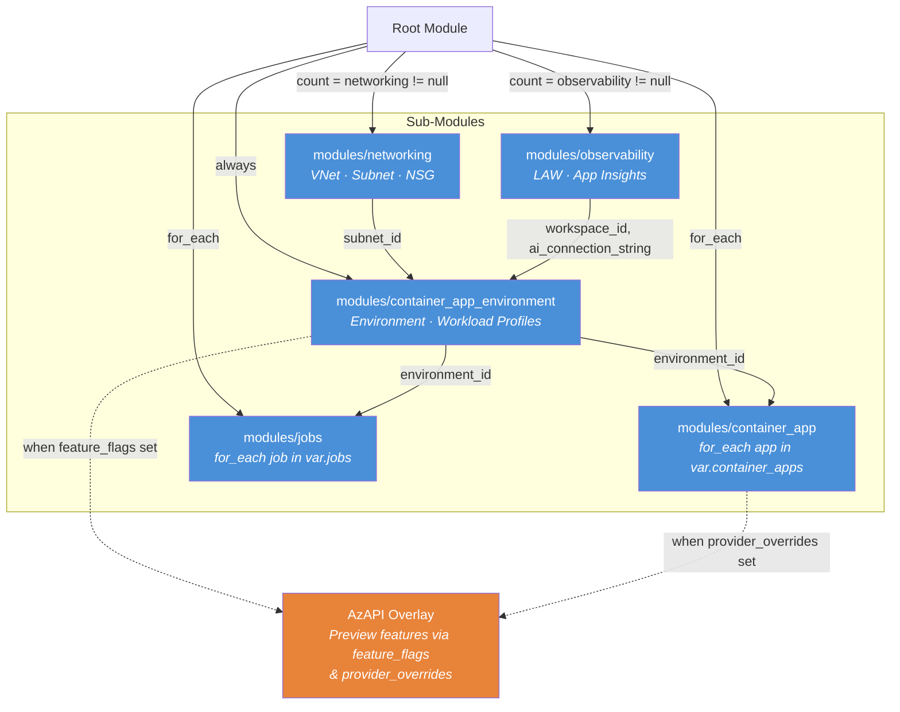

# Examples

## Overview

The **Terraform ACA Extension Layer** is a facade module that wraps `azurerm` Container App resources and transparently uses `azapi` for preview features not yet available in AzureRM. One module call creates a VNet, NSG, Log Analytics workspace, Application Insights, Container App Environment, N apps, and N jobs — replacing the 10–15 resource blocks and manual wiring you'd need with raw `azurerm`.

The module bakes in operational best practices — subnet delegation handling, NSG→subnet ordering via `depends_on`, lifecycle management for Azure Policy tags, and conditional ILB/zone-redundancy validation. Feature flags toggle preview capabilities without changing resource definitions, and brownfield support lets you bring existing VNets, Log Analytics workspaces, and more via `existing_*_id` variables.

Variable names match AzureRM 1:1, so migrating from raw `azurerm` to the module (or back) is trivial.

## Lines of Terraform: Raw AzureRM vs This Module

| Example | Raw `azurerm` (est.) | This Module | Reduction |
|---|---|---|---|
| Simple App | ~120 lines | ~30 lines | **75%** |
| Enterprise App | ~250 lines | ~80 lines | **68%** |
| Microservices (3 apps) | ~400 lines | ~120 lines | **70%** |
| Jobs (scheduled + event) | ~200 lines | ~80 lines | **60%** |
| Dynamic Sessions (AzAPI) | ~180 lines | ~60 lines | **67%** |
| SMB Storage Volumes | ~220 lines | ~100 lines | **55%** |
| Sticky Sessions (AzAPI) | ~150 lines | ~40 lines | **73%** |
| Private Endpoint | ~350 lines | ~120 lines | **66%** |
| Custom Domains | ~180 lines | ~50 lines | **72%** |
| Autoscaling (AzAPI) | ~200 lines | ~60 lines | **70%** |
| Additional Ports (AzAPI) | ~250 lines | ~80 lines | **68%** |
| Blue/Green Deployment | ~180 lines | ~50 lines | **72%** |
| CORS API (AzAPI) | ~220 lines | ~70 lines | **68%** |
| Java Spring (AzAPI) | ~300 lines | ~90 lines | **70%** |
| Init Containers | ~160 lines | ~50 lines | **69%** |

## Examples Matrix

| Example | Complexity | Features Demonstrated | Resources Created |
|---|---|---|---|
| [simple_app](simple_app/) | ⭐ Beginner | VNet, LAW, single app with external ingress | RG, VNet, Subnet, NSG, LAW, Environment, 1 App |
| [enterprise_app](enterprise_app/) | ⭐⭐ Intermediate | mTLS, workload profiles, App Insights, managed identity, custom NSG rules | RG, VNet, Subnet, NSG, LAW, App Insights, Environment (D4 profile), 1 App |
| [microservices](microservices/) | ⭐⭐⭐ Advanced | Dapr service invocation, 3-app topology, distributed tracing, secrets | RG, LAW, App Insights, Environment, 3 Apps (frontend, backend-api, worker) |
| [jobs](jobs/) | ⭐⭐ Intermediate | CRON jobs, event-driven jobs, Azure Queue scaling, retry policies | RG, LAW, Environment, 2 Jobs (scheduled + event-driven) |
| [sessions](sessions/) | ⭐⭐⭐ Advanced | AzAPI overlay pattern, dynamic session pools, two-phase deploy | RG, LAW, Environment, 1 App, 1 Session Pool (AzAPI) |
| [storage](storage/) | ⭐⭐⭐ Advanced | Sub-module composition, SMB file shares, volume mounts, depends_on ordering | RG, Storage Account, 2 File Shares, LAW, Environment, 2 Storage Links, 1 App |
| [sticky_sessions](sticky_sessions/) | ⭐⭐ Intermediate | Session affinity via AzAPI feature flags pattern | RG, LAW, Environment, 1 App + AzAPI overlay |
| [private_endpoint](private_endpoint/) | ⭐⭐⭐ Advanced | VNet + ILB + workload profiles + private endpoint + private DNS | RG, VNet, Subnet, NSG, LAW, Environment (workload profiles), 1 App, PE, DNS Zone |
| [custom_domains](custom_domains/) | ⭐⭐ Intermediate | Conditional custom domain binding with managed certificates | RG, LAW, App Insights, Environment, 1 App |
| [autoscaling](autoscaling/) | ⭐⭐ Intermediate | HTTP + KEDA scale rules via AzAPI overlay | RG, LAW, Environment, 1 App + AzAPI scale rules |
| [additional_ports](additional_ports/) | ⭐⭐⭐ Advanced | gRPC/TCP port mapping via AzAPI advanced ingress, VNet required | RG, VNet, Subnet, NSG, LAW, Environment, 1 App + AzAPI ports |
| [blue_green](blue_green/) | ⭐⭐ Intermediate | Multi-revision mode with traffic splitting for blue/green deploys | RG, LAW, App Insights, Environment, 1 App (2 revisions) |
| [cors_api](cors_api/) | ⭐⭐ Intermediate | Frontend + API apps with CORS policy via AzAPI overlay | RG, LAW, Environment, 2 Apps + AzAPI CORS |
| [java_spring](java_spring/) | ⭐⭐⭐ Advanced | Eureka + Config Server via AzAPI Java components + service bindings | RG, LAW, Environment, 2 Java Components (AzAPI), 1 App |
| [init_containers](init_containers/) | ⭐⭐ Intermediate | Init containers with shared EmptyDir volumes | RG, LAW, Environment, 1 App (init + main container) |

## Module Architecture



**Blue** = AzureRM resources (stable) · **Orange** = AzAPI resources (preview features)

## Prerequisites

| Requirement | Version |
|---|---|
| Terraform | >= 1.5.0 |
| AzureRM provider | >= 4.0.0 |
| AzAPI provider | >= 2.0.0 |
| Azure CLI | Latest (`az login` authenticated) |
| Azure Subscription | With Container Apps resource provider registered |

## Quick Start

```bash
# 1. Clone and navigate to an example
cd examples/simple_app

# 2. Authenticate
az login

# 3. Deploy
terraform init
terraform plan -out=tfplan
terraform apply tfplan

# 4. Verify
terraform output app_urls

# 5. Clean up
terraform destroy
```

## Example READMEs

- [Simple App](simple_app/) — Minimal single-app deployment
- [Enterprise App](enterprise_app/) — Production-grade with mTLS and workload profiles
- [Microservices](microservices/) — Three-app Dapr architecture
- [Jobs](jobs/) — Scheduled and event-driven Container App Jobs
- [Dynamic Sessions](sessions/) — AzAPI preview feature overlay
- [SMB Storage](storage/) — File share volumes with sub-module composition
- [Sticky Sessions](sticky_sessions/) — Session affinity via AzAPI feature flags
- [Private Endpoint](private_endpoint/) — VNet + ILB + private endpoint + private DNS
- [Custom Domains](custom_domains/) — Conditional domain binding with managed certs
- [Autoscaling](autoscaling/) — HTTP + KEDA scale rules via AzAPI
- [Additional Ports](additional_ports/) — gRPC/TCP port mapping with VNet
- [Blue/Green](blue_green/) — Multi-revision traffic splitting
- [CORS API](cors_api/) — Frontend + API with CORS policy
- [Java Spring](java_spring/) — Eureka + Config Server via AzAPI
- [Init Containers](init_containers/) — Init containers with shared volumes
