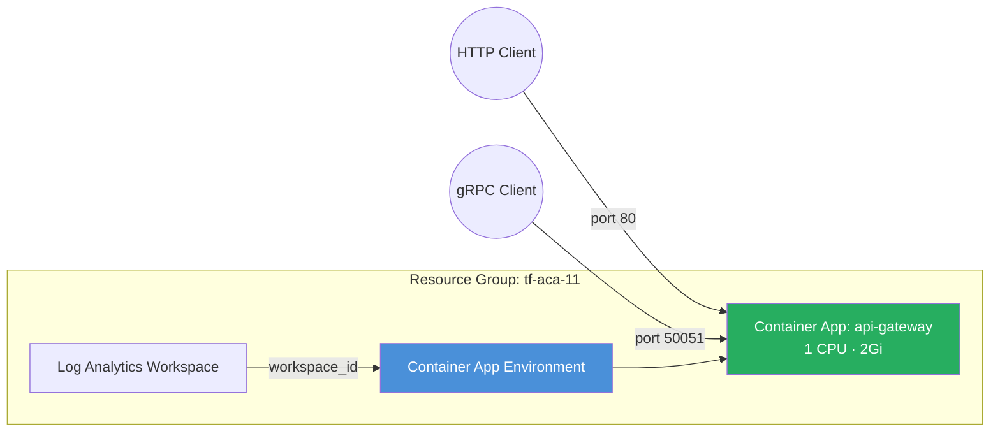

# Additional Port Mappings

Demonstrates how to expose multiple ports on a single Container App — for
example HTTP on port 80 and gRPC on port 50051 — using the module's
`feature_flags` and `additional_port_mappings` pattern.

## Why Feature Flags?

The `azurerm` provider does not yet support `additionalPortMappings` on
Container Apps (340+ days since GA in the Azure API). The module works around
this by applying an `azapi_update_resource` overlay when
`feature_flags.advanced_ingress = true`. You get the feature today without
leaving Terraform, and when `azurerm` catches up you can set
`provider_overrides = { advanced_ingress = "azurerm" }` to drop the overlay.

## Architecture



## How It Works

1. The root module creates the container app with standard HTTP ingress on
   port 80 via `azurerm_container_app`.
2. Because `feature_flags.advanced_ingress = true`, the container app sub-module
   applies an `azapi_update_resource` that patches the ARM resource to add the
   additional port mapping (gRPC on 50051).
3. Clients can connect to the app's FQDN on port 80 for HTTP or port 50051
   for gRPC — both go to the same container.

## Resources Created

| Resource | Type | Purpose |
|---|---|---|
| Resource Group | `azurerm_resource_group` | Container for all resources |
| Log Analytics Workspace | `azurerm_log_analytics_workspace` | Container logs and metrics |
| Environment | `azurerm_container_app_environment` | ACA control plane |
| Container App | `azurerm_container_app` | API gateway with HTTP ingress |
| AzAPI Overlay | `azapi_update_resource` | Adds gRPC port 50051 mapping |

## Usage

```bash
terraform init
terraform plan -out=tfplan
terraform apply tfplan

# Get the app URL (HTTP)
terraform output api_gateway_url

# gRPC clients connect to the same FQDN on port 50051
```

## Variables

| Name | Description | Default |
|---|---|---|
| `name` | Base name for the deployment | `aca-ports` |
| `resource_group_name` | Resource group name | `tf-aca-11` |
| `location` | Azure region | `swedencentral` |
| `container_image` | Container image | `mcr.microsoft.com/azuredocs/containerapps-helloworld:latest` |
| `tags` | Resource tags | `{environment="dev", managed_by="terraform"}` |

## Outputs

| Name | Description |
|---|---|
| `environment_id` | Container App Environment resource ID |
| `environment_default_domain` | Default domain for the environment |
| `api_gateway_url` | Public FQDN of the API gateway (HTTP) |
| `api_gateway_id` | Resource ID of the API gateway container app |

## What's Next?

- Replace the hello-world image with a real dual-protocol service (e.g.
  Envoy, gRPC-gateway, or a custom app).
- Combine with the [Autoscaling](../autoscaling/) example to add scale rules
  for both HTTP and gRPC traffic.
