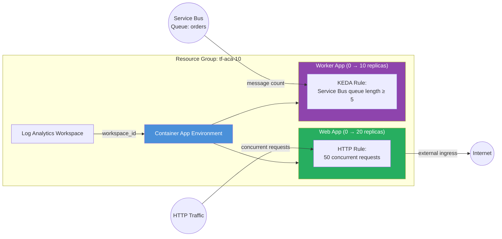

# Autoscaling Example

Demonstrates advanced autoscaling on Azure Container Apps using HTTP
concurrency rules and custom KEDA scalers. Both apps scale to zero when idle,
minimising cost for bursty or event-driven workloads.

## Why Sub-Modules + AzAPI Overlay?

The container app module's `template` variable is strictly typed and does not
include scale-rule fields. Instead of forking the module, this example calls the
sub-modules directly and then applies `azapi_update_resource` overlays to inject
the scale rules into the ARM template. This keeps the base module clean while
giving full control over the KEDA scaling configuration.

## Architecture



## Scale-to-Zero

Both apps set `min_replicas = 0`. When there is no HTTP traffic (web) or no
messages in the queue (worker), ACA scales the app down to zero replicas — you
pay nothing while idle.

| App | Trigger | Min → Max Replicas | Threshold |
|---|---|---|---|
| `web` | HTTP concurrent requests | 0 → 20 | 50 per replica |
| `worker` | Azure Service Bus queue | 0 → 10 | 5 messages |

## How It Works

1. **Web app** — The `azapi_update_resource.web_scaling` overlay adds an HTTP
   scale rule. ACA's built-in HTTP scaler monitors concurrent request count and
   adds replicas when the threshold is exceeded.

2. **Worker app** — The `azapi_update_resource.worker_scaling` overlay adds a
   custom KEDA scaler for Azure Service Bus. KEDA polls the queue and scales
   based on the `messageCount` metadata. The worker has no ingress (it consumes
   from the queue only).

## Resources Created

| Resource | Type | Purpose |
|---|---|---|
| Resource Group | `azurerm_resource_group` | Container for all resources |
| Log Analytics Workspace | `azurerm_log_analytics_workspace` | Container logs and metrics |
| Environment | `azurerm_container_app_environment` | ACA control plane |
| Web App | `azurerm_container_app` | HTTP-scaled public app |
| Web Scaling Overlay | `azapi_update_resource` | HTTP concurrency scale rule |
| Worker App | `azurerm_container_app` | Queue-scaled background worker |
| Worker Scaling Overlay | `azapi_update_resource` | KEDA Service Bus scale rule |

## Usage

```bash
terraform init
terraform plan -out=tfplan
terraform apply tfplan

# Get the web app URL
terraform output web_app_url
```

For a real deployment, point the Service Bus scaler at your namespace:

```bash
terraform apply \
  -var servicebus_namespace=my-sb-namespace \
  -var servicebus_queue_name=orders
```

## Variables

| Name | Description | Default |
|---|---|---|
| `name` | Base name for the deployment | `aca-autoscale` |
| `resource_group_name` | Resource group name | `tf-aca-10` |
| `location` | Azure region | `swedencentral` |
| `container_image` | Container image for both apps | `mcr.microsoft.com/azuredocs/containerapps-helloworld:latest` |
| `http_concurrency_threshold` | Concurrent requests before scale-out | `50` |
| `servicebus_namespace` | Service Bus namespace | `placeholder-namespace` |
| `servicebus_queue_name` | Queue name for KEDA scaler | `orders` |
| `servicebus_message_count` | Message count threshold | `5` |

## Outputs

| Name | Description |
|---|---|
| `environment_id` | Container App Environment resource ID |
| `environment_default_domain` | Default domain for the environment |
| `web_app_id` | Resource ID of the web app |
| `web_app_url` | Public FQDN of the web app |
| `worker_app_id` | Resource ID of the worker app |
| `worker_app_name` | Name of the worker app |

## What's Next?

- Swap `placeholder-namespace` for a real Service Bus namespace and add
  authentication (connection string secret or managed identity).
- Add more KEDA scalers — ACA supports 50+ scaler types (Kafka, Redis,
  PostgreSQL, Prometheus, etc.).
- Combine with the [Blue/Green](../blue_green/) example to do zero-downtime
  deployments of auto-scaled apps.
