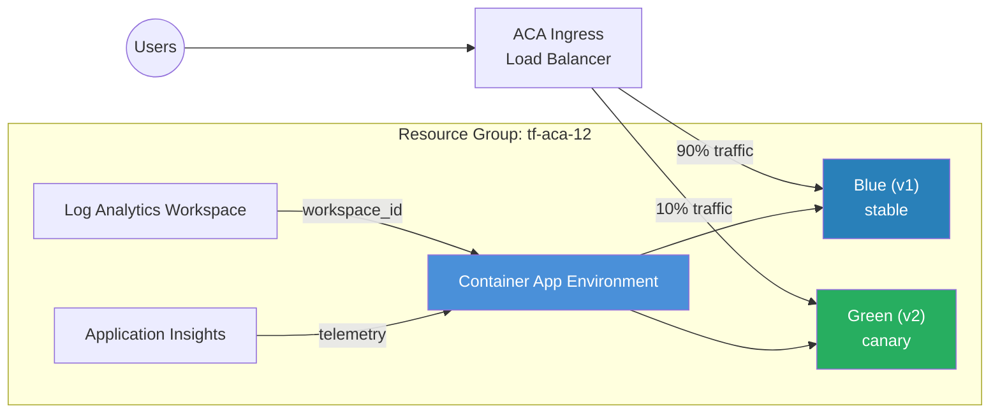

# Blue/Green Deployment

Demonstrates blue/green deployments on Azure Container Apps using multiple
revision mode, traffic splitting, and revision labels. Deploy new versions
alongside existing ones and shift traffic gradually — with instant rollback.

## Architecture



## How Blue/Green Works on ACA

Azure Container Apps in **Multiple** revision mode keep old revisions running
alongside new ones. Combined with traffic weights and revision labels, this
gives you a full blue/green (or canary) deployment workflow.

### Step-by-Step Workflow

**1. Initial deployment (blue)**

```bash
terraform apply \
  -var revision_suffix=v1 \
  -var app_version=1.0.0
```

This creates the first revision with 100% of traffic and the `latest` label.

**2. Deploy green revision**

```bash
terraform apply \
  -var revision_suffix=v2 \
  -var app_version=2.0.0
```

A new revision `v2` is created and receives 100% of traffic (as `latest`).
The old `v1` revision is still running but receives no traffic.

**3. Split traffic (canary)**

To send only a fraction of traffic to the new revision, update the
`traffic_weight` block in `main.tf`:

```hcl
traffic_weight = [
  {
    latest_revision = false
    revision_suffix = "v1"
    percentage      = 90
    label           = "blue"
  },
  {
    latest_revision = true
    percentage      = 10
    label           = "green"
  },
]
```

Then apply:

```bash
terraform apply \
  -var revision_suffix=v2 \
  -var app_version=2.0.0
```

**4. Promote or rollback**

- **Promote green**: Set the green revision to 100% and remove the blue weight.
- **Rollback**: Set the blue revision back to 100%.

### Label-Based Routing

Each revision label gets its own FQDN:

```
# Production (weighted)
https://<app-name>.<default-domain>

# Direct access to blue
https://<app-name>---blue.<default-domain>

# Direct access to green
https://<app-name>---green.<default-domain>
```

Use these to test a specific revision before shifting production traffic.

## Resources Created

| Resource | Type | Purpose |
|---|---|---|
| Resource Group | `azurerm_resource_group` | Container for all resources |
| Log Analytics Workspace | `azurerm_log_analytics_workspace` | Container logs and metrics |
| Application Insights | `azurerm_application_insights` | Revision-level telemetry |
| Environment | `azurerm_container_app_environment` | ACA control plane |
| Container App | `azurerm_container_app` | `web` — multi-revision app |

## Usage

```bash
terraform init
terraform plan -out=tfplan
terraform apply tfplan

# Get the app URL
terraform output web_app_url

# See the current revision
terraform output web_app_latest_revision
```

Deploy a new version:

```bash
terraform apply \
  -var revision_suffix=v2 \
  -var app_version=2.0.0
```

## Variables

| Name | Description | Default |
|---|---|---|
| `name` | Base name for the deployment | `aca-bluegreen` |
| `resource_group_name` | Resource group name | `tf-aca-12` |
| `location` | Azure region | `swedencentral` |
| `container_image` | Container image | `mcr.microsoft.com/azuredocs/containerapps-helloworld:latest` |
| `revision_suffix` | Revision suffix (change to create new revision) | `v1` |
| `app_version` | App version env var | `1.0.0` |
| `tags` | Resource tags | `{environment="dev", managed_by="terraform"}` |

## Outputs

| Name | Description |
|---|---|
| `environment_id` | Container App Environment resource ID |
| `environment_default_domain` | Default domain for the environment |
| `web_app_url` | Public FQDN of the web app |
| `web_app_id` | Resource ID of the web app |
| `web_app_latest_revision` | Name of the latest revision |

## What's Next?

- Add Application Insights metrics to monitor error rates per revision before
  promoting.
- Combine with the [Autoscaling](../autoscaling/) example to auto-scale each
  revision independently.
- Automate the traffic-shift workflow in CI/CD (e.g. GitHub Actions) by
  updating `traffic_weight` and running `terraform apply`.
