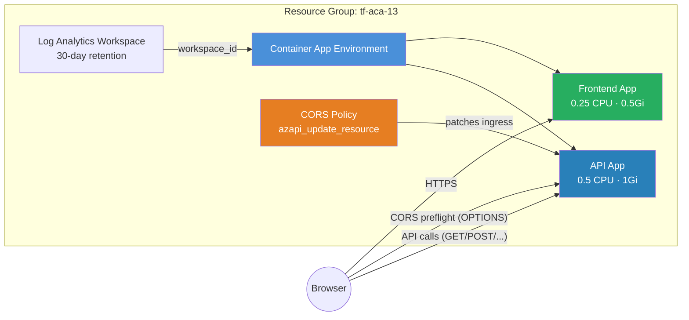

# CORS API Example

Deploys a **frontend SPA** and a **backend API** on Azure Container Apps, then
patches a CORS policy onto the API using `azapi_update_resource`. This pattern
is necessary because the module's container app template does not expose a
`cors_policy` field — and `azurerm` itself only added CORS support for Container
Apps in June 2025, more than two years after the feature went GA in the Azure
REST API.

## Why Use AzAPI for CORS?

The Azure Container Apps API has supported CORS since its early preview, but the
`azurerm` provider lagged behind. Rather than waiting for provider parity, this
example shows how to use `azapi_update_resource` to patch CORS onto a module-
managed app without modifying the module itself. This is the recommended
"escape hatch" pattern for any ARM property not yet surfaced by the module.

## Architecture



### Request Flow

| Step | From | To | Description |
|------|------|----|-------------|
| 1 | Browser | Frontend App | Loads SPA assets (HTML, JS, CSS) |
| 2 | Browser | API App | Sends `OPTIONS` preflight request |
| 3 | API App | Browser | Returns CORS headers (allowed origins, methods, headers) |
| 4 | Browser | API App | Sends actual API request (`GET`, `POST`, etc.) |

## Resources Created

| Resource | Type | Purpose |
|---|---|---|
| Resource Group | `azurerm_resource_group` | Container for all resources |
| Log Analytics Workspace | `azurerm_log_analytics_workspace` | Container logs and metrics |
| Environment | `azurerm_container_app_environment` | ACA control plane |
| API App | `azurerm_container_app` | Backend API with external ingress |
| Frontend App | `azurerm_container_app` | SPA serving frontend assets |
| CORS Policy | `azapi_update_resource` | Patches CORS onto the API app ingress |

## Usage

```bash
terraform init
terraform plan -out=tfplan
terraform apply tfplan

# Get the app URLs
terraform output api_url
terraform output frontend_url
```

Customize the allowed origins:

```bash
terraform apply -var 'cors_allowed_origins=["https://myapp.example.com", "http://localhost:3000"]'
```

## Variables

| Name | Description | Default |
|---|---|---|
| `name` | Base name for the deployment | `aca-cors` |
| `resource_group_name` | Resource group name | `tf-aca-13` |
| `location` | Azure region | `swedencentral` |
| `container_image` | Container image for both apps | `mcr.microsoft.com/azuredocs/containerapps-helloworld:latest` |
| `cors_allowed_origins` | Origins allowed for CORS | `["https://example.com"]` |
| `tags` | Resource tags | `{environment="dev", managed_by="terraform"}` |

## Outputs

| Name | Description |
|---|---|
| `environment_id` | Container App Environment resource ID |
| `environment_default_domain` | Default domain for the environment |
| `api_url` | Public HTTPS URL for the API app |
| `frontend_url` | Public HTTPS URL for the frontend app |
| `api_id` | Resource ID of the API container app |

## CORS Configuration Details

The CORS policy applied to the API allows:

- **Origins**: Configurable via `cors_allowed_origins` variable
- **Methods**: `GET`, `POST`, `PUT`, `DELETE`, `OPTIONS`
- **Headers**: All (`*`)
- **Exposed Headers**: `X-Request-Id` (for request tracing)
- **Max Age**: 3600 seconds (preflight cache duration)
- **Credentials**: Enabled (cookies / Authorization headers allowed)

## What's Next?

- Add custom domains and TLS certificates for production
- Restrict `cors_allowed_origins` to your actual frontend domain
- See the [Enterprise App](../enterprise_app/) example for mTLS and workload profiles
