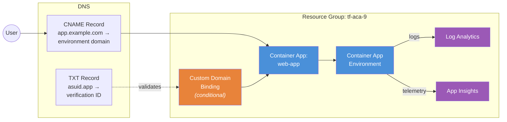

# Custom Domain Binding with Managed Certificate

Demonstrates the **custom domain binding** pattern for Azure Container Apps.
The app deploys and works with the default ACA domain out of the box. Custom
domain binding is an **optional add-on** — enabled only when `var.custom_domain`
is set to a real domain name.

## The 2-Step Process

Custom domain binding for ACA follows a DNS-validated flow:

1. **DNS Validation** — Create DNS records proving domain ownership
2. **Domain Binding** — Terraform creates the `azurerm_container_app_custom_domain`
   resource, which triggers Azure to validate DNS and provision a managed TLS
   certificate automatically

### DNS Records Required

Before setting `var.custom_domain`, create these DNS records at your registrar:

| Record Type | Name | Value |
|---|---|---|
| `CNAME` | `<subdomain>` | `<environment_default_domain>` (from outputs) |
| `TXT` | `asuid.<subdomain>` | `<custom_domain_verification_id>` (from outputs) |

For example, to bind `app.example.com`:
```
CNAME  app        → myenv.swedencentral.azurecontainerapps.io
TXT    asuid.app  → ABC123DEF456...
```

## Architecture



## Conditional Resource Pattern

The custom domain resources use `count` to be created only when a domain is
provided. This ensures the example deploys cleanly without any domain
configuration:

```hcl
resource "azurerm_container_app_custom_domain" "this" {
  count = var.custom_domain != "" ? 1 : 0

  name             = var.custom_domain
  container_app_id = module.aca.container_apps["web"].id
}
```

## Resources Created

| Resource | Provider | Condition | Purpose |
|---|---|---|---|
| Resource Group | AzureRM | Always | Container for all resources |
| Log Analytics Workspace | AzureRM (via module) | Always | Container logs |
| Application Insights | AzureRM (via module) | Always | App telemetry |
| Container App Environment | AzureRM (via module) | Always | ACA control plane |
| web-app | AzureRM (via module) | Always | Web application |
| Custom Domain Binding | AzureRM | `var.custom_domain != ""` | Domain + managed cert |

## Usage

### Deploy without custom domain (default)

```bash
terraform init
terraform apply
```

The app is accessible at the default ACA domain shown in the `web_app_url` output.

### Deploy with custom domain

```bash
# Step 1: Deploy the app and get the verification ID + environment domain
terraform apply

# Step 2: Create DNS records at your registrar using the outputs:
#   CNAME: app → <environment_default_domain>
#   TXT:   asuid.app → <custom_domain_verification_id>

# Step 3: Wait for DNS propagation, then bind the domain
terraform apply -var custom_domain="app.example.com"
```

## Variables

| Name | Description | Default |
|---|---|---|
| `name` | Base name for the deployment | `aca-domains` |
| `resource_group_name` | Resource group name | `tf-aca-9` |
| `location` | Azure region | `swedencentral` |
| `tags` | Tags for all resources | `{ environment = "dev", ... }` |
| `container_image` | Container image | `mcr.microsoft.com/azuredocs/containerapps-helloworld:latest` |
| `custom_domain` | Custom domain to bind (empty = skip) | `""` |

## Outputs

| Name | Description |
|---|---|
| `environment_id` | Container App Environment resource ID |
| `environment_default_domain` | Default domain of the environment |
| `web_app_url` | Default FQDN of the web app |
| `custom_domain_verification_id` | Verification ID for DNS TXT record |
| `custom_domain_bound` | The custom domain that was bound (null if none) |
| `app_urls` | Map of all app names to their FQDNs |
