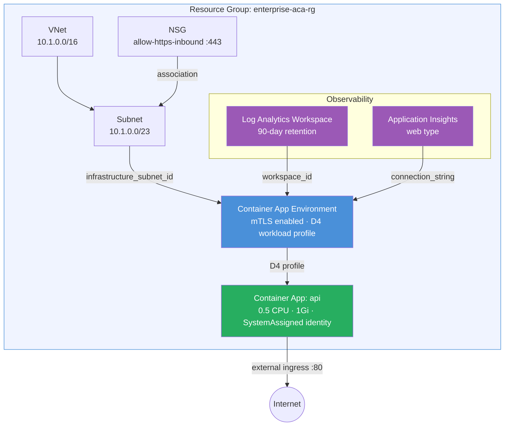

# Enterprise App Example

Production-grade ACA deployment showcasing VNet integration, dedicated workload
profiles (`D4`), mutual TLS, managed identity, custom NSG rules, and full
observability with Log Analytics and Application Insights. This is the reference
pattern for running production APIs on Azure Container Apps.

## Why Use the Module?

Building this with raw `azurerm` requires **~250 lines** and careful wiring:

- **Workload profiles**: You need `workload_profile` blocks inside the environment,
  then reference the profile name on each app — the module validates the reference.
- **mTLS**: A single `mutual_tls_enabled = true` flag on the module vs configuring
  the environment property and ensuring your apps handle mTLS correctly.
- **App Insights integration**: Without the module you must create an App Insights
  resource, extract its connection string, and pass it to the environment's
  `dapr_application_insights_connection_string`. The module wires this automatically
  when `create_application_insights = true`.
- **Managed identity**: The module passes `identity` straight through, but it also
  handles the environment-level identity propagation that ACA needs.
- **NSG rules**: Custom rules are defined inline; the module handles NSG creation
  and subnet association ordering via `depends_on`.

With the module: **~80 lines** of focused configuration.

## Architecture



## Resources Created

| Resource | Type | Purpose |
|---|---|---|
| Resource Group | `azurerm_resource_group` | Container for all resources |
| Virtual Network | `azurerm_virtual_network` | Isolated network (10.1.0.0/16) |
| Subnet | `azurerm_subnet` | ACA dedicated subnet (10.1.0.0/23) |
| NSG | `azurerm_network_security_group` | HTTPS inbound rule (port 443) |
| Log Analytics Workspace | `azurerm_log_analytics_workspace` | Logs with 90-day retention |
| Application Insights | `azurerm_application_insights` | APM and distributed tracing |
| Environment | `azurerm_container_app_environment` | mTLS, D4 workload profile (1–3 nodes) |
| Container App | `azurerm_container_app` | `api` — production API with managed identity |

## Key Features

| Feature | Configuration | What the Module Handles |
|---|---|---|
| mTLS | `mutual_tls_enabled = true` | Sets environment property, no app-level changes needed |
| Workload Profiles | `workload_profile = [{name="dedicated-d4", type="D4", min=1, max=3}]` | Creates profile on environment, validates app assignment |
| App Insights | `create_application_insights = true` | Creates resource + wires connection string to environment |
| Managed Identity | `identity = {type = "SystemAssigned"}` | Passes through to app; outputs `principal_id` for RBAC |

## Usage

```bash
terraform init
terraform plan -out=tfplan
terraform apply tfplan

# Get the API app name and identity principal ID
terraform output api_name
terraform output managed_identity_principal_id
```

> **Note**: D4 workload profiles require quota in your subscription. Check
> `az containerapp env workload-profile list-supported` for availability.

## Variables

| Name | Description | Default |
|---|---|---|
| `name` | Base name for the deployment | `enterprise-aca` |
| `resource_group_name` | Resource group name | `enterprise-aca-rg` |
| `location` | Azure region | `eastus2` |
| `environment` | Deployment environment label | `Production` |
| `cost_center` | Cost center tag for billing | `engineering` |
| `container_image` | Container image | `mcr.microsoft.com/azuredocs/containerapps-helloworld:latest` |
| `vnet_address_space` | VNet address space | `["10.1.0.0/16"]` |
| `aca_subnet_address_prefix` | ACA subnet CIDR (must be /23 or larger) | `10.1.0.0/23` |
| `container_port` | Port the container listens on | `80` |
| `min_replicas` | Minimum replicas | `1` |
| `max_replicas` | Maximum replicas | `5` |

## Outputs

| Name | Description |
|---|---|
| `environment_id` | Container App Environment resource ID |
| `environment_default_domain` | Default domain for the environment |
| `api_name` | Name of the API container app |
| `vnet_id` | VNet resource ID |
| `managed_identity_principal_id` | Principal ID of the system-assigned identity (for RBAC) |
| `application_insights_instrumentation_key` | App Insights instrumentation key (sensitive) |
