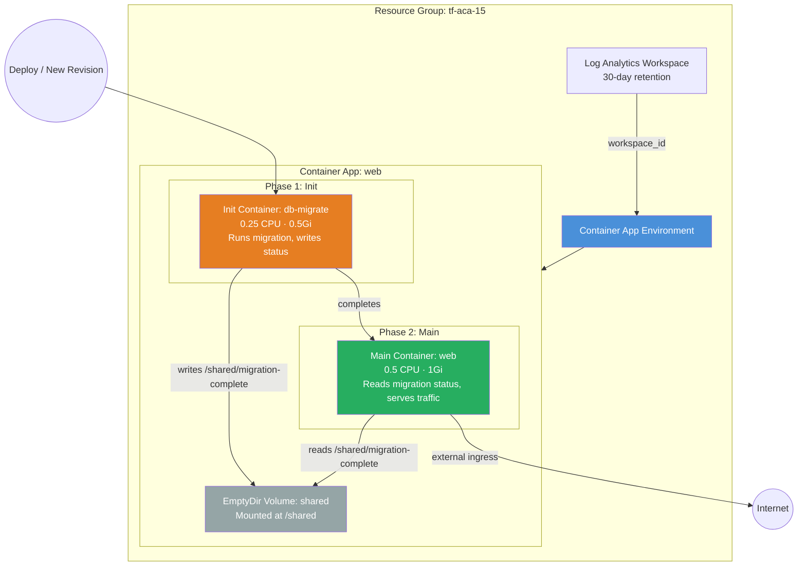

# Init Containers Example

Deploys a **web application** on Azure Container Apps with an **init container**
that runs database migrations before the main container starts. The init
container and main container share an `EmptyDir` volume so the migration process
can signal completion status to the application.

## Why Init Containers?

Init containers run to completion before any main containers start — the
Kubernetes-native sidecar pattern ported to ACA. Common use cases:

- **Database migrations**: Run schema changes before the app boots
- **Configuration seeding**: Populate config files or warm caches
- **Dependency checks**: Verify external services are reachable
- **Secret fetching**: Pull secrets from a vault into a shared volume

This example uses a placeholder migration container. In production, replace
the init container image with your actual migration tool (e.g., Flyway,
Liquibase, EF Core migrations, Alembic).

## Architecture



### Execution Order

| Phase | Container | What Happens |
|-------|-----------|-------------|
| 1 | `db-migrate` (init) | Runs migration against the database, writes status to `/shared/migration-complete` |
| 2 | `web` (main) | Starts only after init completes, reads migration status from `/shared/migration-complete` |

## Resources Created

| Resource | Type | Purpose |
|---|---|---|
| Resource Group | `azurerm_resource_group` | Container for all resources |
| Log Analytics Workspace | `azurerm_log_analytics_workspace` | Container logs and metrics |
| Environment | `azurerm_container_app_environment` | ACA control plane |
| Web App | `azurerm_container_app` | Main app with init container, shared volume, and external ingress |

## Usage

```bash
terraform init
terraform plan -out=tfplan
terraform apply tfplan

# Get the web app URL
terraform output web_url
```

Override the container image:

```bash
terraform apply -var container_image="myregistry.azurecr.io/myapp:v1.0"
```

## Variables

| Name | Description | Default |
|---|---|---|
| `name` | Base name for the deployment | `aca-init` |
| `resource_group_name` | Resource group name | `tf-aca-15` |
| `location` | Azure region | `swedencentral` |
| `container_image` | Container image for the main web app | `mcr.microsoft.com/azuredocs/containerapps-helloworld:latest` |
| `tags` | Resource tags | `{environment="dev", managed_by="terraform"}` |

## Outputs

| Name | Description |
|---|---|
| `environment_id` | Container App Environment resource ID |
| `environment_default_domain` | Default domain for the environment |
| `web_url` | Public HTTPS URL for the web app |
| `web_id` | Resource ID of the web container app |
| `web_name` | Name of the web container app |

## Adapting for Production

1. **Replace the init image**: Use your migration tool image instead of the placeholder
2. **Add secrets**: Pass database credentials via Container App secrets, not environment variables
3. **Set resource limits**: Adjust init container CPU/memory based on migration workload
4. **Add health probes**: Configure liveness/readiness probes on the main container
5. **Volume cleanup**: The `EmptyDir` volume is ephemeral — it resets on each new revision

## What's Next?

- See the [Storage](../storage/) example for persistent Azure Files volumes
- See the [Enterprise App](../enterprise_app/) example for managed identity and workload profiles
