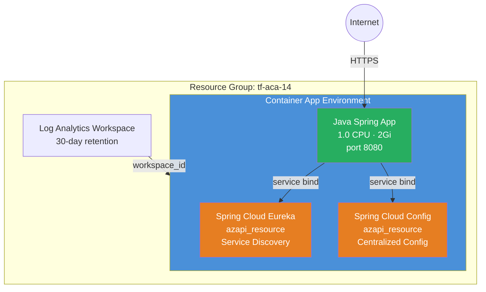

# Java Spring Cloud Components Example

Deploys a **Spring Boot application** on Azure Container Apps with managed
**Spring Cloud Eureka** (service discovery) and **Spring Cloud Config Server**
(centralized configuration) components. These Java components are environment-
level resources with no `azurerm` equivalent — they are created via
`azapi_resource` and bound to the app through service binds.

## Why Use AzAPI for Java Components?

Azure Container Apps has native support for managed Java components (Eureka,
Config Server, Spring Boot Admin), but the `azurerm` provider does not expose
these resources at all. This example demonstrates sub-module composition: the
environment and app are created with the module's sub-modules, while the Java
components and service binds are managed via `azapi_resource` and
`azapi_update_resource`.

## Architecture



### Service Bind Pattern

Service binds inject connection information into the app's environment at
runtime. The Spring Boot app auto-discovers Eureka and Config Server without
any manual URL or credential configuration:

| Component | Service Bind Name | What It Provides |
|---|---|---|
| Spring Cloud Eureka | `eureka` | Service registry URL, credentials |
| Spring Cloud Config | `configserver` | Config server URL, credentials |

## Resources Created

| Resource | Type | Purpose |
|---|---|---|
| Resource Group | `azurerm_resource_group` | Container for all resources |
| Log Analytics Workspace | `azurerm_log_analytics_workspace` | Container logs and metrics |
| Environment | `azurerm_container_app_environment` | ACA control plane |
| Eureka Server | `azapi_resource` (Java component) | Spring Cloud service discovery |
| Config Server | `azapi_resource` (Java component) | Centralized Spring configuration |
| Java App | `azurerm_container_app` | Spring Boot application |
| Service Binds | `azapi_update_resource` | Binds Java components to the app |

## Usage

```bash
terraform init
terraform plan -out=tfplan
terraform apply tfplan

# Get the app URL
terraform output java_app_url
```

Deploy without Config Server (Eureka only):

```bash
terraform apply -var enable_config_server=false
```

Use a custom config repository:

```bash
terraform apply -var config_git_uri="https://github.com/my-org/my-config-repo"
```

## Variables

| Name | Description | Default |
|---|---|---|
| `name` | Base name for the deployment | `aca-java` |
| `resource_group_name` | Resource group name | `tf-aca-14` |
| `location` | Azure region | `swedencentral` |
| `container_image` | Container image for the Spring Boot app | `mcr.microsoft.com/azuredocs/containerapps-helloworld:latest` |
| `enable_config_server` | Whether to create Config Server | `true` |
| `config_git_uri` | Git repository URI for Config Server | `https://github.com/spring-cloud-samples/config-repo` |
| `tags` | Resource tags | `{environment="dev", managed_by="terraform"}` |

## Outputs

| Name | Description |
|---|---|
| `environment_id` | Container App Environment resource ID |
| `environment_name` | Container App Environment name |
| `environment_default_domain` | Default domain for the environment |
| `java_app_id` | Resource ID of the Java app |
| `java_app_name` | Name of the Java app |
| `java_app_url` | Public HTTPS URL for the Java app |
| `eureka_id` | Resource ID of the Eureka component |
| `config_server_id` | Resource ID of the Config Server component |

## What's Next?

- Replace the placeholder image with your actual Spring Boot app
- Add Spring Boot Admin as a third Java component for monitoring
- See the [Microservices](../microservices/) example for Dapr-based communication
