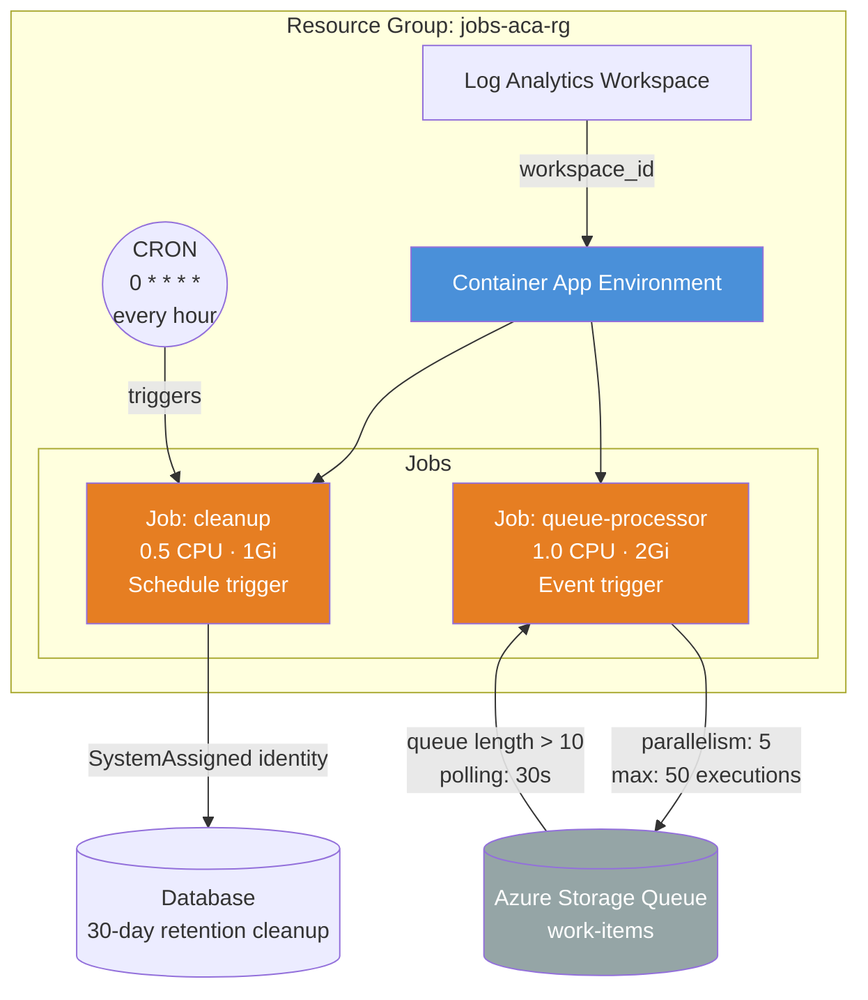

# Container App Jobs — Scheduled & Event-Driven

Deploys a jobs-only ACA environment with two Container App Jobs: a **CRON-scheduled
cleanup job** that runs hourly, and an **event-driven queue processor** that scales
based on Azure Storage Queue depth. No long-running apps — just jobs.

## Why Use the Module?

The module's `jobs` map supports all 3 trigger types (schedule, event, manual) with
a consistent interface. Without the module you'd need **~200 lines** of raw `azurerm`:

- **Two separate `azurerm_container_app_job` resources**, each manually wired to the
  environment ID, with their own trigger configurations and secret blocks.
- **Event-driven scaling**: The queue processor's `event_trigger_config` includes
  KEDA scale rules (queue type, metadata, authentication). With raw `azurerm`, you
  configure `scale` blocks inside `event_trigger_config` and manage secret
  references for authentication — the module keeps this co-located and readable.
- **Trigger type selection**: The module accepts `schedule_trigger_config`,
  `event_trigger_config`, or `manual_trigger_config` — exactly one per job. No
  need for separate resource types or conditional logic.
- **Secrets and identity**: Both jobs need secrets and managed identities. The module
  passes these through identically to container apps — same interface, less context
  switching.

## Architecture



## Job Configurations

| Job | Trigger | Schedule / Scale | Timeout | Retries |
|---|---|---|---|---|
| `cleanup` | CRON | `0 * * * *` (hourly), parallelism 1 | 1800s (30min) | 0 |
| `queue-processor` | Azure Queue | 0–50 executions, queue length threshold 10 | 600s (10min) | 3 |

## Resources Created

| Resource | Type | Purpose |
|---|---|---|
| Resource Group | `azurerm_resource_group` | Container for all resources |
| Log Analytics Workspace | `azurerm_log_analytics_workspace` | Job execution logs |
| Environment | `azurerm_container_app_environment` | ACA control plane |
| cleanup | `azurerm_container_app_job` | Hourly data retention cleanup (CRON) |
| queue-processor | `azurerm_container_app_job` | Azure Queue message processor (event-driven) |

## Usage

```bash
terraform init

# Provide connection strings for the jobs
terraform apply \
  -var db_connection_string="Server=tcp:mydb.database.windows.net;..." \
  -var queue_connection_string="DefaultEndpointsProtocol=https;..." \
  -var storage_account_name="mystorageaccount"

# Check job details
terraform output cleanup_job
terraform output queue_processor_job
```

> For the event-driven job, ensure the Azure Storage Queue exists before deploying.

## Variables

| Name | Description | Default |
|---|---|---|
| `name` | Base name for the deployment | `jobs-aca` |
| `resource_group_name` | Resource group name | `jobs-aca-rg` |
| `location` | Azure region | `eastus2` |
| `cleanup_job_image` | Cleanup job container image | `mcr.microsoft.com/k8se/quickstart:latest` |
| `queue_processor_image` | Queue processor container image | `mcr.microsoft.com/k8se/quickstart:latest` |
| `db_connection_string` | DB connection string (sensitive) | `""` |
| `queue_connection_string` | Queue connection string (sensitive) | `""` |
| `queue_name` | Storage Queue name | `work-items` |
| `storage_account_name` | Storage Account name | `mystorageaccount` |
| `cleanup_cron_expression` | CRON schedule for cleanup job | `0 * * * *` |
| `cleanup_timeout_seconds` | Cleanup job replica timeout (s) | `1800` |
| `queue_timeout_seconds` | Queue processor replica timeout (s) | `600` |
| `queue_replica_retry_limit` | Queue processor max retries | `3` |

## Outputs

| Name | Description |
|---|---|
| `environment_id` | Container App Environment resource ID |
| `cleanup_job` | Cleanup job resource details (id, name) |
| `queue_processor_job` | Queue processor job resource details (id, name) |
