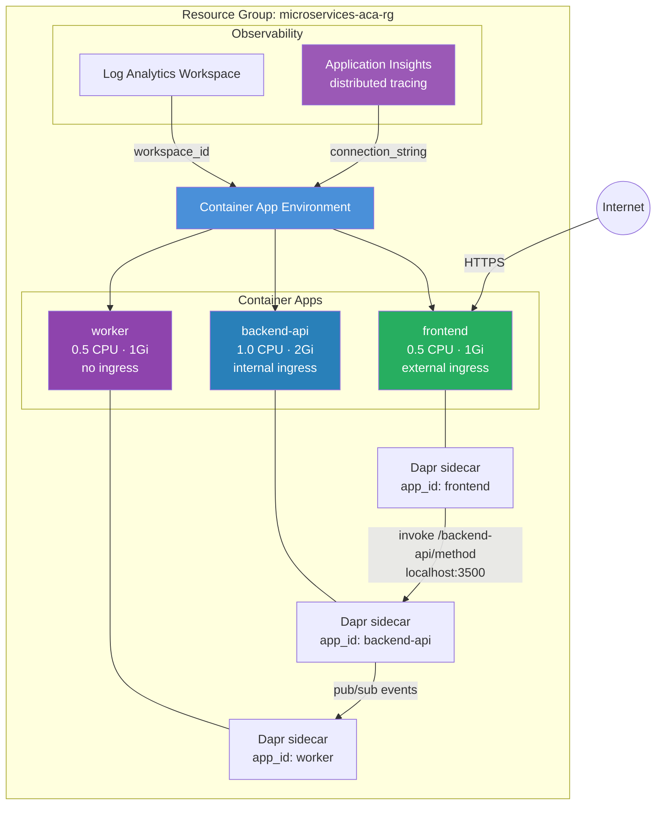

# Microservices with Dapr Service Invocation

Deploys a three-tier microservices architecture on ACA: a public **frontend**, an
internal **backend-api**, and a background **worker** — all communicating via Dapr
service invocation and pub/sub. Application Insights provides end-to-end
distributed tracing across all three services.

## Why Use the Module?

Deploying 3 interconnected Dapr apps with raw `azurerm` requires **~400 lines**:

- **Three separate `azurerm_container_app` resources**, each with its own template,
  ingress, Dapr config, secrets, and identity blocks — lots of repeated boilerplate.
- **Secrets management**: The `db-connection-string` secret must be defined
  identically on `backend-api` and `worker`. With the module's `container_apps` map,
  each app's secrets are defined inline and co-located with the app config.
- **Ingress visibility**: External (frontend), internal (backend-api), and none
  (worker) require different ingress configurations. The module normalizes these
  through the same `ingress` object — set `external_enabled` or omit `ingress`
  entirely for no-ingress apps.
- **Dapr wiring**: Each app needs `app_id`, `app_port`, and `app_protocol`. The
  module passes these through to the `azurerm_container_app` Dapr block without
  extra boilerplate.
- **Observability**: Creating App Insights and wiring the connection string to the
  environment is a single flag (`create_application_insights = true`).

With the module, all 3 apps are defined in a single `container_apps` map block.

## Architecture



### Communication Pattern

| From | To | Method | Path |
|---|---|---|---|
| Frontend | Backend API | Dapr service invocation | `http://localhost:3500/v1.0/invoke/backend-api/method/{endpoint}` |
| Backend API | Worker | Dapr pub/sub | Event-driven message passing |
| Internet | Frontend | HTTPS | External ingress (public FQDN) |

## Resources Created

| Resource | Type | Purpose |
|---|---|---|
| Resource Group | `azurerm_resource_group` | Container for all resources |
| Log Analytics Workspace | `azurerm_log_analytics_workspace` | Container logs |
| Application Insights | `azurerm_application_insights` | Distributed tracing across all 3 apps |
| Environment | `azurerm_container_app_environment` | Shared Dapr runtime |
| frontend | `azurerm_container_app` | Public web app — Dapr sidecar, external ingress |
| backend-api | `azurerm_container_app` | Internal API — Dapr sidecar, managed identity, DB secret |
| worker | `azurerm_container_app` | Background processor — Dapr sidecar, DB secret, no ingress |

## Usage

```bash
terraform init

# Required: provide a database connection string
terraform apply -var db_connection_string="Server=tcp:mydb.database.windows.net;..."

# Get the public frontend URL
terraform output frontend_url
```

> **Do not commit real secrets** — use `terraform.tfvars` (gitignored) or
> environment variables (`TF_VAR_db_connection_string`).

## Variables

| Name | Description | Default |
|---|---|---|
| `name` | Base name for the deployment | `microservices-aca` |
| `resource_group_name` | Resource group name | `microservices-aca-rg` |
| `location` | Azure region | `eastus2` |
| `frontend_image` | Frontend container image | `mcr.microsoft.com/k8se/quickstart:latest` |
| `backend_api_image` | Backend API container image | `mcr.microsoft.com/k8se/quickstart:latest` |
| `worker_image` | Worker container image | `mcr.microsoft.com/k8se/quickstart:latest` |
| `db_connection_string` | Database connection string (**required**, sensitive) | — |
| `frontend_port` | Frontend listen port | `80` |
| `backend_api_port` | Backend API listen port | `80` |
| `worker_port` | Worker Dapr listen port | `80` |
| `frontend_min_replicas` / `max` | Frontend replica range | `1` / `5` |
| `backend_api_min_replicas` / `max` | Backend API replica range | `2` / `10` |
| `worker_min_replicas` / `max` | Worker replica range | `1` / `20` |

## Outputs

| Name | Description |
|---|---|
| `environment_id` | Container App Environment resource ID |
| `environment_default_domain` | Default domain for the environment |
| `frontend_url` | Public HTTPS URL for the frontend |
| `backend_api_name` | Name of the backend API container app |
| `worker_name` | Name of the worker container app |
