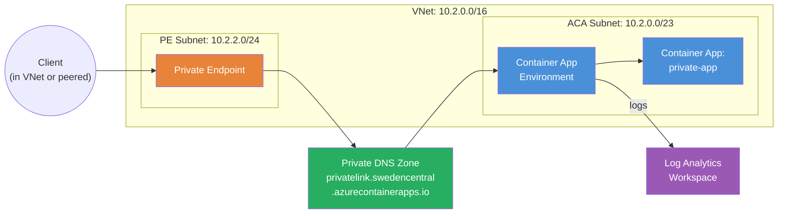

# Private Endpoint for ACA Environment

Demonstrates **private endpoint** connectivity for an Azure Container Apps
environment. Private endpoints for ACA environments went GA in API version
`2025-07-01` but are **not yet available** in the AzureRM Terraform provider.
This example shows how to combine the module's sub-modules with direct
`azurerm_private_endpoint` resources to achieve fully private network access.

## Why Private Endpoints?

By default, ACA environments expose applications through a public load balancer.
For enterprise workloads, you need to:

- Restrict access to a corporate VNet (no public internet exposure)
- Comply with network isolation policies
- Access the environment from on-premises via VPN/ExpressRoute

Private endpoints assign a private IP from your VNet to the ACA environment,
making it accessible only through the private network.

## Architecture



## Sub-Module Composition Pattern

This example uses the module's sub-modules directly (like the storage example)
because we need to orchestrate resources in a specific order:

1. **VNet + Subnets** — Created first with proper delegation
2. **Observability** — Log Analytics workspace
3. **Environment** — ACA environment with `internal_load_balancer_enabled = true`
4. **Private DNS Zone** — `privatelink.<region>.azurecontainerapps.io`
5. **Private Endpoint** — Targets the environment with `managedEnvironments` sub-resource
6. **Container App** — Internal-only ingress, accessible via private endpoint

```hcl
resource "azurerm_private_endpoint" "aca" {
  name                = "${var.name}-pe"
  location            = azurerm_resource_group.this.location
  resource_group_name = azurerm_resource_group.this.name
  subnet_id           = azurerm_subnet.pe.id

  private_service_connection {
    name                           = "${var.name}-psc"
    private_connection_resource_id = module.environment.id
    subresource_names              = ["managedEnvironments"]
    is_manual_connection           = false
  }

  private_dns_zone_group {
    name                 = "default"
    private_dns_zone_ids = [azurerm_private_dns_zone.aca.id]
  }
}
```

## Network Layout

| Subnet | CIDR | Purpose |
|---|---|---|
| `aca-subnet` | `10.2.0.0/23` | ACA environment (requires /23 minimum) |
| `pe-subnet` | `10.2.2.0/24` | Private endpoint NIC |

## Resources Created

| Resource | Provider | Purpose |
|---|---|---|
| Resource Group | AzureRM | Container for all resources |
| VNet + 2 Subnets | AzureRM | Network infrastructure |
| Log Analytics Workspace | AzureRM (via module) | Container logs |
| Container App Environment | AzureRM (via module) | ACA control plane (internal LB) |
| Private DNS Zone | AzureRM | DNS resolution for private endpoint |
| Private DNS Zone VNet Link | AzureRM | Links DNS zone to the VNet |
| Private Endpoint | AzureRM | Private IP for the ACA environment |
| Container App | AzureRM (via module) | Internal-only app |

## Usage

```bash
terraform init
terraform apply
```

After apply, the container app is accessible only from within the VNet (or
peered networks). The private endpoint resolves through the private DNS zone.

To test from a VM in the same VNet:
```bash
curl https://<app_fqdn>
```

## Variables

| Name | Description | Default |
|---|---|---|
| `name` | Base name for the deployment | `aca-private` |
| `resource_group_name` | Resource group name | `tf-aca-8` |
| `location` | Azure region | `swedencentral` |
| `container_image` | Container image | `mcr.microsoft.com/azuredocs/containerapps-helloworld:latest` |

## Outputs

| Name | Description |
|---|---|
| `environment_id` | Container App Environment resource ID |
| `environment_default_domain` | Default domain of the environment |
| `private_endpoint_ip` | Private IP address of the endpoint |
| `private_dns_zone_name` | Private DNS zone name |
| `app_name` | Name of the container app |
| `app_fqdn` | Internal FQDN (resolvable via private DNS) |
