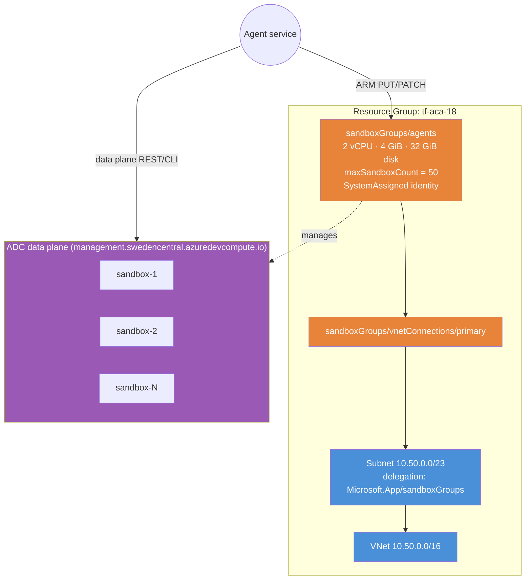

# ACA Sandbox Groups (AzAPI-only Feature)

Demonstrates **ACA Sandboxes**, a new ACA product that provisions disposable
Linux VMs ("sandboxes") inside a managed group. Sandbox groups are ideal for:

- **AI agent code execution** — give each agent task its own VM, kill it on completion.
- **Untrusted code isolation** — run customer-supplied code without polluting shared infra.
- **Per-tenant ephemeral compute** — fast cold-start, no infrastructure to manage.

## Why AzAPI?

`Microsoft.App/sandboxGroups` is a **brand-new ARM resource type** with **zero
AzureRM support** today (preview API version `2026-02-01-preview`). The module
manages the group and its `vnetConnections` child resources entirely via
`azapi_resource`.

## Two-plane model (important)

| Plane | Endpoint | What lives here |
|---|---|---|
| **ARM control plane** | `management.azure.com` | The sandbox group + VNet connections (this module) |
| **ADC data plane** | `management.{region}.azuredevcompute.io` | Individual sandboxes, disk images, snapshots, volumes, secrets, ports |

This module **only manages the ARM control plane**. Individual sandbox CRUD
happens against the data plane via the `aca` CLI, REST, or SDK — using the
`sandbox_group_management_endpoint` output as the base URL.

## The sandbox_groups map

The module exposes a top-level `sandbox_groups` map (mirrors `jobs` /
`container_apps`):

```hcl
module "aca" {
  source = "github.com/Azure/terraform-provider-aca"

  name                = "agent-platform"
  resource_group_name = azurerm_resource_group.rg.name
  location            = "swedencentral"

  sandbox_groups = {
    agents = {
      default_cpu             = "2"
      default_memory          = "4Gi"
      default_disk            = "32Gi"
      max_sandbox_count       = 50
      default_timeout_seconds = 3600

      identity = { type = "SystemAssigned" }

      vnet_connections = {
        primary = { subnet_id = azurerm_subnet.sbx.id }
      }
    }
  }
}
```

## Architecture



**Orange** = AzAPI-managed resources. **Blue** = AzureRM. **Purple** = data plane (out of Terraform scope).

## Resources Created

| Resource | Provider | Purpose |
|---|---|---|
| Resource Group | AzureRM | Container for all resources |
| VNet (`10.50.0.0/16`) | AzureRM | Sandbox networking |
| Subnet (`10.50.0.0/23`) | AzureRM | Delegated to `Microsoft.App/sandboxGroups` |
| `sandboxGroups/agents` | **AzAPI** (via module) | The group itself |
| `sandboxGroups/vnetConnections/primary` | **AzAPI** (via module) | Binds the group to the subnet |

## Usage

```bash
terraform init
terraform apply

# Grab the ADC endpoint for data-plane calls
ENDPOINT=$(terraform output -raw sandbox_group_management_endpoint)

# Spin up a sandbox via the aca CLI (data plane)
aca sandbox create --group $(terraform output -raw sandbox_group_name) --disk ubuntu
```

## RBAC

The principal driving the data plane needs the
**Container Apps SandboxGroup Data Owner** role on the group (or RG /
subscription). Assign it after `terraform apply`:

```bash
az role assignment create \
  --assignee <objectId> \
  --role "Container Apps SandboxGroup Data Owner" \
  --scope $(terraform output -raw sandbox_group_id)
```

## Variables

| Name | Description | Default |
|---|---|---|
| `name` | Base name for the deployment | `aca-sandbox` |
| `resource_group_name` | Resource group name | `tf-aca-18` |
| `location` | Azure region | `swedencentral` |
| `default_cpu` | Default vCPU per sandbox | `2` |
| `default_memory` | Default memory per sandbox | `4Gi` |
| `default_disk` | Default disk per sandbox | `32Gi` |
| `max_sandbox_count` | Concurrent sandbox cap | `50` |
| `default_timeout_seconds` | Idle teardown timeout | `3600` |
| `tags` | Tags for all resources | `{ environment = "dev", ... }` |

## Outputs

| Name | Description |
|---|---|
| `sandbox_group_id` | ARM resource ID |
| `sandbox_group_name` | Group name |
| `sandbox_group_management_endpoint` | ADC data-plane endpoint |
| `sandbox_group_principal_id` | System-assigned identity principal ID |
| `sandbox_group_vnet_connection_ids` | Map of VNet connection IDs |
| `sandbox_subnet_id` | Delegated subnet ID |
