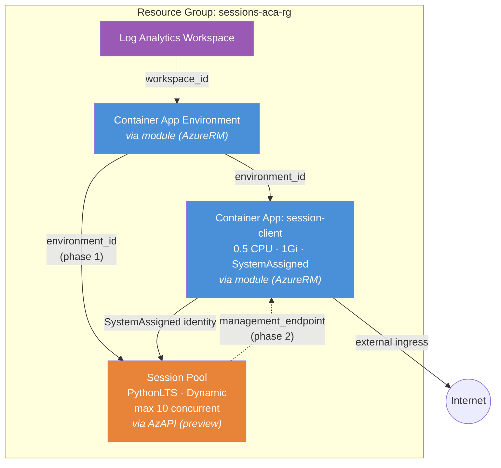

# Dynamic Sessions (AzAPI Preview Feature)

Demonstrates the module's **hybrid provider strategy**: the ACA environment and
client app are created via the module (AzureRM), while a Dynamic Sessions pool
(Python code interpreter) is created directly via **AzAPI** using the
`2024-10-02-preview` API. This is the key example for understanding the AzAPI
overlay pattern.

## Why Use the Module?

This example showcases the module's core design philosophy — **AzureRM-first,
AzAPI for the gaps**:

- `Microsoft.App/sessionPools` is **not available in the AzureRM provider**. The
  only way to create session pools in Terraform is via AzAPI.
- The module creates the environment and client app through its normal AzureRM
  path. The session pool is created alongside using `azapi_resource` — consuming
  the module's `environment_id` output.
- This pattern extends to any preview ACA feature: use the module for stable
  resources, add `azapi_resource` blocks for preview resources that reference
  module outputs.
- A **two-phase deploy** is required because the session pool needs the environment
  ID (created in phase 1), and the client app needs the pool's management endpoint
  (wired in phase 2).

Without this hybrid approach, you'd need to manage the entire deployment through
AzAPI — losing all the module's composition, validation, and best practices.

## Architecture



**Blue** = AzureRM resources (stable) · **Orange** = AzAPI resources (preview)

## Two-Phase Deploy

The circular dependency between the session pool and the client app requires a
two-phase approach:

```
Phase 1                              Phase 2
────────                             ────────
Environment ──→ Session Pool         Client App updated with
            ──→ Client App              SESSION_POOL_ENDPOINT
            (endpoint = "")             from Phase 1 output
```

**Why not a direct reference?** If the client app referenced
`azapi_resource.session_pool.output.properties.poolManagementEndpoint` directly,
it would create a circular dependency: the pool needs `environment_id` (from the
module), and the app needs the pool endpoint (from the pool) — but both are
created by the same apply.

## Why AzAPI?

| Aspect | AzureRM | AzAPI |
|---|---|---|
| `Microsoft.App/sessionPools` | ❌ Not supported | ✅ `2024-10-02-preview` |
| Environment, Apps, Jobs | ✅ Full support | ✅ (but unnecessary) |
| State management | Native | Native |
| Plan/Apply cycle | Standard | Standard |

The module handles everything AzureRM supports. AzAPI fills the gap for preview
features — the two providers coexist cleanly in the same state file.

## Resources Created

| Resource | Provider | Purpose |
|---|---|---|
| Resource Group | AzureRM | Container for all resources |
| Log Analytics Workspace | AzureRM (via module) | Container logs |
| Environment | AzureRM (via module) | ACA control plane |
| session-client | AzureRM (via module) | Client app that calls the session pool |
| Session Pool | **AzAPI** (preview) | PythonLTS code interpreter pool |

## Usage

```bash
terraform init

# Phase 1: Create environment, app, and session pool
terraform apply

# Phase 2: Wire the pool endpoint into the client app
ENDPOINT=$(terraform output -raw session_pool_management_endpoint)
terraform apply -var session_pool_endpoint="$ENDPOINT"
```

After phase 2, the client app's `SESSION_POOL_ENDPOINT` environment variable
points to the session pool's management API.

## Variables

| Name | Description | Default |
|---|---|---|
| `name` | Base name for the deployment | `sessions-aca` |
| `resource_group_name` | Resource group name | `sessions-aca-rg` |
| `location` | Azure region (must support Dynamic Sessions) | `eastus2` |
| `max_concurrent_sessions` | Max concurrent sessions in pool | `10` |
| `ready_session_instances` | Pre-warmed session instances | `1` |
| `session_pool_endpoint` | Pool management endpoint (set after phase 1) | `""` |

## Outputs

| Name | Description |
|---|---|
| `environment_id` | Container App Environment resource ID |
| `session_pool_id` | Session pool resource ID |
| `session_pool_name` | Session pool name |
| `session_pool_management_endpoint` | Pool management endpoint (use as `session_pool_endpoint` in phase 2) |
| `client_app_name` | Name of the session client container app |
