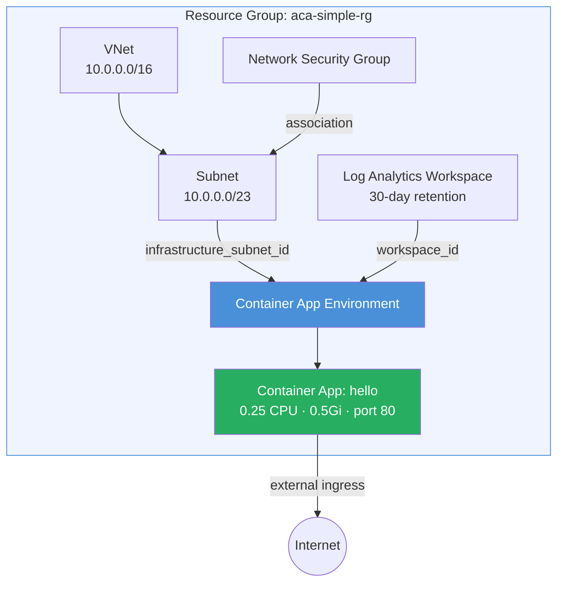

# Simple App Example

Deploys a minimal Azure Container Apps environment with a single public-facing
hello-world container app. This is the fastest way to get a container running on
ACA — one module call, ~30 lines of config, and you have a VNet-integrated
environment with logging and a publicly accessible app.

## Why Use the Module?

Without the module you would write **~120 lines** of raw `azurerm`:

1. `azurerm_virtual_network` + `azurerm_subnet` (with correct /23 sizing and delegation)
2. `azurerm_network_security_group` + `azurerm_subnet_network_security_group_association`
3. `azurerm_log_analytics_workspace`
4. `azurerm_container_app_environment` (wiring subnet ID and workspace ID)
5. `azurerm_container_app` (wiring environment ID, ingress, template)

The module collapses all of that into a single `module "aca"` call with ~30
lines. It handles subnet sizing validation, NSG→subnet ordering, and LAW
retention defaults — all best practices you'd otherwise implement manually.

## Architecture



## Resources Created

| Resource | Type | Purpose |
|---|---|---|
| Resource Group | `azurerm_resource_group` | Container for all resources |
| Virtual Network | `azurerm_virtual_network` | Isolated network (10.0.0.0/16) |
| Subnet | `azurerm_subnet` | ACA dedicated subnet (10.0.0.0/23) |
| NSG | `azurerm_network_security_group` | Network security rules |
| Log Analytics Workspace | `azurerm_log_analytics_workspace` | Container logs and metrics |
| Environment | `azurerm_container_app_environment` | ACA control plane |
| Container App | `azurerm_container_app` | `hello` — single public app |

## Usage

```bash
terraform init
terraform plan -out=tfplan
terraform apply tfplan

# Get the app URL
terraform output app_urls
```

Override defaults:

```bash
terraform apply -var name=my-app -var resource_group_name=my-app-rg
```

## Variables

| Name | Description | Default |
|---|---|---|
| `name` | Base name for the deployment | `aca-simple` |
| `resource_group_name` | Resource group name | `aca-simple-rg` |
| `location` | Azure region | `eastus2` |
| `container_image` | Container image | `mcr.microsoft.com/azuredocs/containerapps-helloworld:latest` |
| `vnet_address_space` | VNet address space | `["10.0.0.0/16"]` |
| `aca_subnet_address_prefix` | ACA subnet CIDR (must be /23 or larger) | `10.0.0.0/23` |
| `container_port` | Port the container listens on | `80` |
| `min_replicas` | Minimum replicas | `0` |
| `max_replicas` | Maximum replicas | `3` |
| `tags` | Resource tags | `{environment="dev", managed_by="terraform"}` |

## Outputs

| Name | Description |
|---|---|
| `environment_id` | Container App Environment resource ID |
| `environment_default_domain` | Default domain for the environment |
| `app_urls` | Map of app names to their public FQDNs |

## What's Next?

Ready for production features? See the [Enterprise App](../enterprise_app/) example
for mTLS, workload profiles, Application Insights, and managed identity.
