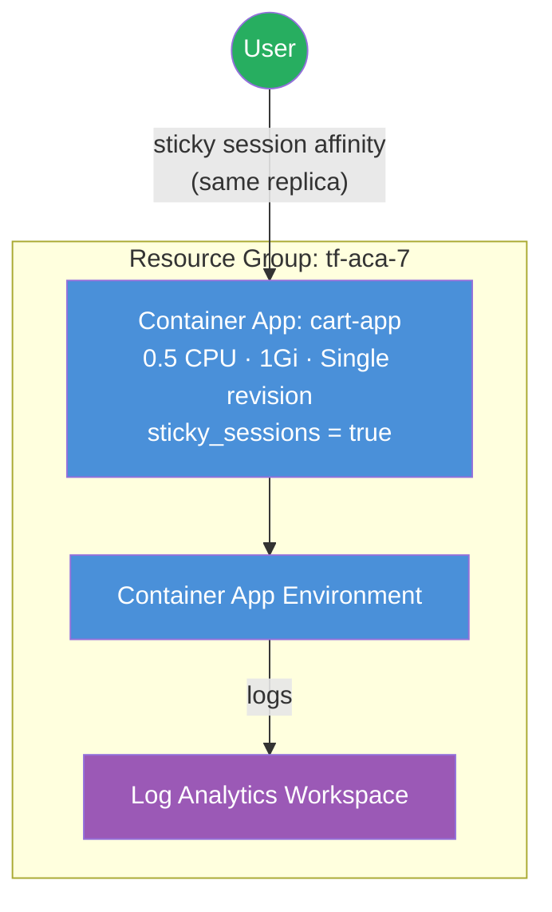

# Sticky Sessions (AzAPI Overlay Feature)

Demonstrates **sticky session affinity** for Azure Container Apps — the #1
missing feature from the AzureRM provider. Sticky sessions reached GA in the
Azure platform in **May 2023**, yet as of writing the AzureRM provider still
has no support after **670+ days**. This example uses the module's
`feature_flags` pattern to apply sticky sessions through **AzAPI** while
keeping every other resource on AzureRM.

## Why Sticky Sessions?

Stateful workloads like shopping carts, form wizards, and WebSocket connections
require that subsequent requests from the same client are routed to the same
container replica. Without sticky sessions, in-memory session state is lost when
the load balancer routes a request to a different replica.

## The feature_flags Pattern

The module exposes a `feature_flags` map on each container app. Setting
`sticky_sessions = true` triggers an AzAPI overlay that patches the ingress
configuration with session affinity — without touching the AzureRM resource
lifecycle:

```hcl
container_apps = {
  cart = {
    revision_mode = "Single"
    template      = { ... }
    ingress       = { ... }

    # This single flag enables sticky sessions via AzAPI
    feature_flags = {
      sticky_sessions = true
    }
  }
}
```

The module internally creates an `azapi_update_resource` that sets
`properties.configuration.ingress.stickySessions.affinity` to `"sticky"` on the
Container App. When AzureRM eventually adds native support, flip the provider
override and remove the flag — zero app-level changes required.

## Why AzAPI?

| Aspect | AzureRM | AzAPI |
|---|---|---|
| Sticky sessions (`stickySessions.affinity`) | ❌ Not supported (670+ days) | ✅ GA via overlay |
| Environment, Apps, Ingress | ✅ Full support | ✅ (but unnecessary) |
| State management | Native | Native |

## Architecture



## Resources Created

| Resource | Provider | Purpose |
|---|---|---|
| Resource Group | AzureRM | Container for all resources |
| Log Analytics Workspace | AzureRM (via module) | Container logs |
| Container App Environment | AzureRM (via module) | ACA control plane |
| cart-app | AzureRM (via module) | Shopping cart style app |
| Sticky sessions overlay | **AzAPI** (via module) | Patches ingress with session affinity |

## Usage

```bash
terraform init
terraform apply
```

After apply, the cart app's ingress will have sticky session affinity enabled.
All requests from the same client (identified by an `affinity` cookie) are
routed to the same container replica.

## Variables

| Name | Description | Default |
|---|---|---|
| `name` | Base name for the deployment | `aca-sticky` |
| `resource_group_name` | Resource group name | `tf-aca-7` |
| `location` | Azure region | `swedencentral` |
| `tags` | Tags for all resources | `{ environment = "dev", ... }` |
| `container_image` | Container image for the cart app | `mcr.microsoft.com/azuredocs/containerapps-helloworld:latest` |

## Outputs

| Name | Description |
|---|---|
| `environment_id` | Container App Environment resource ID |
| `environment_default_domain` | Default domain of the environment |
| `cart_app_url` | FQDN of the cart app with sticky sessions |
| `app_urls` | Map of all app names to their FQDNs |
