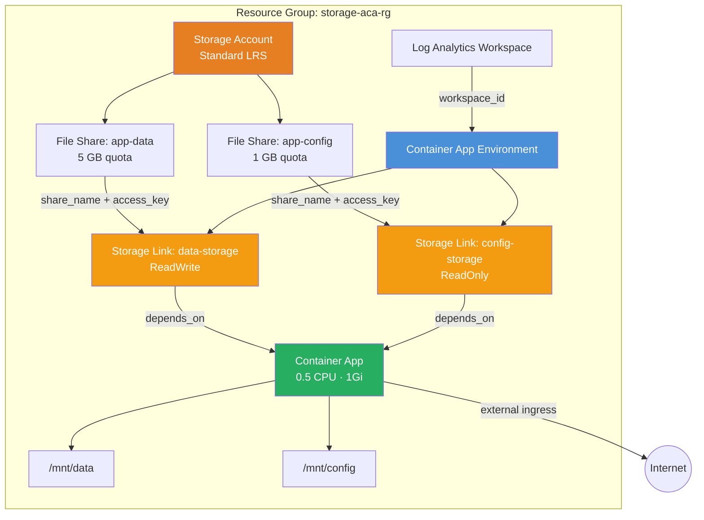

# SMB File Share Volumes

Demonstrates mounting Azure Files SMB shares into a Container App using
environment storage links. This example uses **sub-modules directly** instead of
the root module — showing how to compose the module's building blocks for
advanced scenarios like storage links that must be created between the
environment and the app.

## Why Use the Module?

This example highlights the module's **sub-module composability**. Instead of one
`module "aca"` call, it calls `modules/observability`, `modules/container_app_environment`,
and `modules/container_app` individually. Why?

- **Storage links must exist before the container app** that mounts them. With the
  root module, all apps are created in a single `for_each` — there's no way to
  inject `azurerm_container_app_environment_storage` resources between the
  environment and apps.
- By calling sub-modules directly, you get explicit `depends_on` control:
  `Storage Account → File Shares → Environment Storage Links → Container App`.
- This pattern generalizes to any scenario where you need resources created
  between the environment and apps: custom domains, certificates, Dapr components,
  or managed environment storage.

With raw `azurerm` you'd write **~220 lines** and manage the same dependency chain
manually. The sub-modules still give you the module's validation, naming
conventions, and lifecycle management — you just orchestrate the ordering yourself.

## Architecture



## Root Module vs Sub-Module Approach

| Aspect | Root Module (`module "aca"`) | Sub-Modules (this example) |
|---|---|---|
| One-call simplicity | ✅ Single block | ❌ Multiple blocks |
| Insert resources between env and apps | ❌ Not possible | ✅ Full control |
| Storage links, Dapr components | Must use separate resources + depends_on hacks | Natural ordering via explicit `depends_on` |
| Best for | Standard deployments | Advanced scenarios needing injection points |

## Dependency Chain

```
Storage Account
  → File Shares (app-data, app-config)
    → Environment Storage Links (data-storage RW, config-storage RO)
      → Container App (volume mounts: /mnt/data, /mnt/config)
```

The `depends_on` on `module "container_app"` ensures Terraform creates the storage
links before attempting to create the app that references them.

## Resources Created

| Resource | Type | Purpose |
|---|---|---|
| Resource Group | `azurerm_resource_group` | Container for all resources |
| Storage Account | `azurerm_storage_account` | Standard LRS storage |
| app-data | `azurerm_storage_share` | Read-write data share (5 GB) |
| app-config | `azurerm_storage_share` | Read-only config share (1 GB) |
| Log Analytics Workspace | `azurerm_log_analytics_workspace` | Container logs |
| Environment | `azurerm_container_app_environment` | ACA control plane |
| data-storage | `azurerm_container_app_environment_storage` | RW storage link |
| config-storage | `azurerm_container_app_environment_storage` | RO storage link |
| Container App | `azurerm_container_app` | App with two volume mounts |

## Usage

```bash
terraform init

# Provide a globally unique storage account name
terraform apply -var storage_account_name=<unique-name>

# Verify
terraform output app_name
terraform output storage_account_name
```

> **Production tip**: Change the storage account's `network_rules.default_action`
> to `"Deny"` and add the ACA environment's outbound IPs to `ip_rules`.

## Variables

| Name | Description | Default |
|---|---|---|
| `name` | Base name for the deployment | `storage-aca` |
| `resource_group_name` | Resource group name | `storage-aca-rg` |
| `location` | Azure region | `eastus2` |
| `storage_account_name` | Storage Account name (globally unique, 3–24 chars) | `tfaca6stordata` |
| `share_quota_gb` | Quota for the data file share (GB) | `5` |

## Outputs

| Name | Description |
|---|---|
| `environment_id` | Container App Environment resource ID |
| `storage_account_name` | Storage Account name |
| `data_share_name` | Data file share name (`app-data`) |
| `app_name` | Name of the container app with mounted storage |
